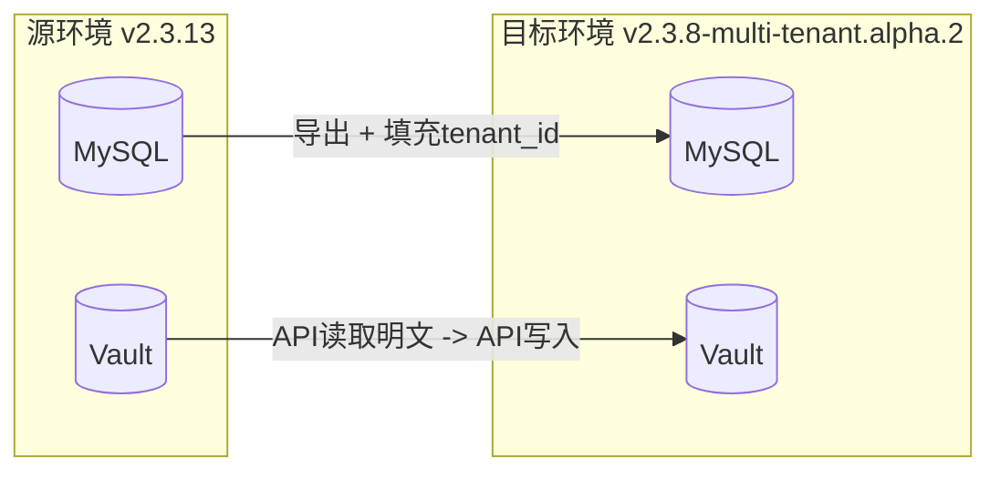
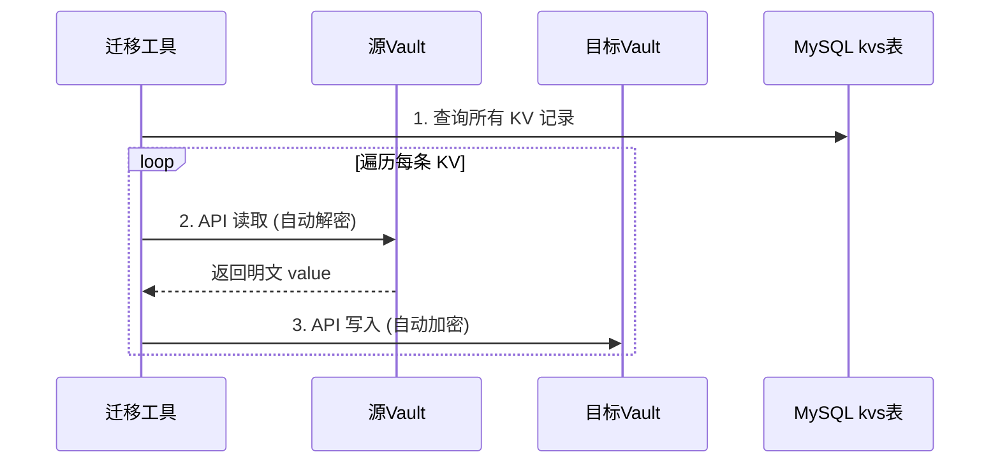
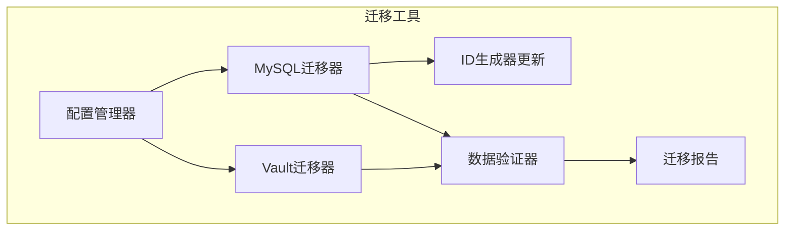
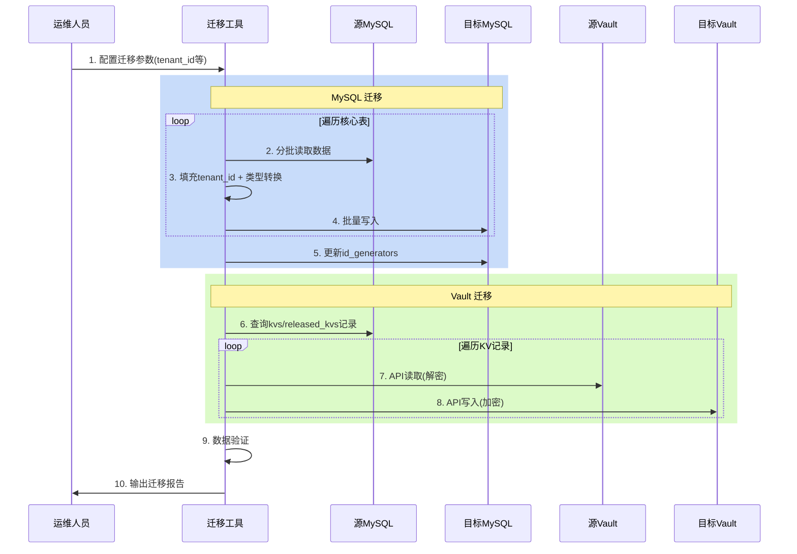
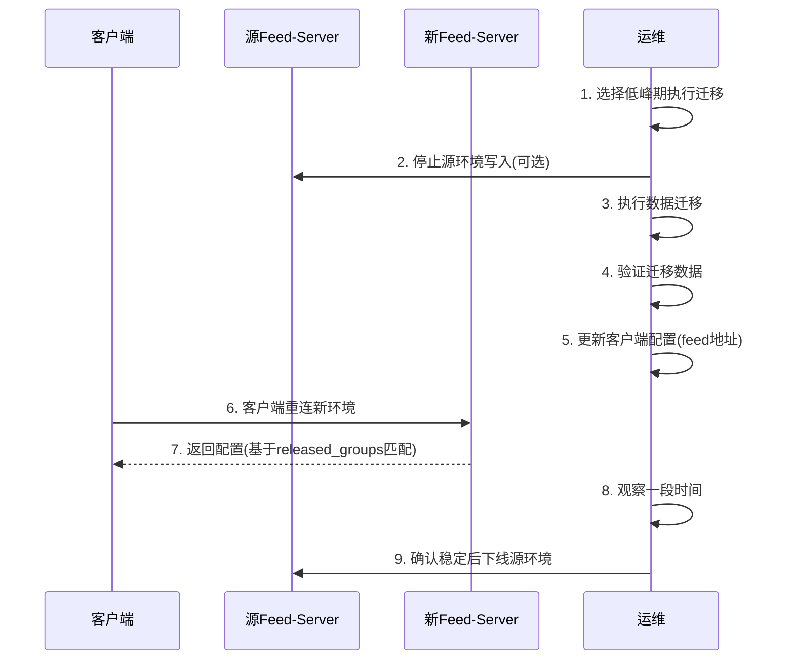

# 单租户到多租户数据迁移方案

## 一、迁移概述



**迁移范围**：

- MySQL: 核心业务数据，填充 tenant_id 值（目标表结构已包含此字段）
- Vault: KV 配置值数据（必须通过 API 迁移，因为两套环境密钥不同）
- ITSM: 跳过，新环境重新配置
- 文件存储: 跳过（bkrepo/cos 单独处理）

---

## 二、MySQL 数据迁移

### 1. 表分类说明

#### 必须迁移的核心业务表（共29张）

| 分类 | 表名 | 说明 |

|------|------|------|

| 应用 | `applications` | 应用定义，核心数据 |

| 配置项 | `config_items`, `commits`, `contents` | 配置文件元数据 |

| 发布 | `releases`, `released_config_items` | 发布版本数据 |

| 策略 | `strategies`, `strategy_sets`, `current_published_strategies` | 当前生效的发布策略 |

| KV配置 | `kvs`, `released_kvs` | KV 配置元数据（值在 Vault） |

| 模板 | `templates`, `template_spaces`, `template_sets`, `template_revisions` | 配置模板 |

| 模板变量 | `template_variables`, `app_template_bindings`, `app_template_variables`, `released_app_templates`, `released_app_template_variables` | 模板变量绑定 |

| 分组 | `groups`, `group_app_binds`, `released_groups` | 分组配置 |

| 钩子 | `hooks`, `hook_revisions`, `released_hooks` | 前置/后置脚本 |

| 凭证 | `credentials`, `credential_scopes` | 服务密钥凭证 |

| 业务分片 | `sharding_bizs` | 业务数据库分片配置 |

#### 可跳过的运行时/历史表（共13张）

| 表名 | 说明 | 跳过原因 |

|------|------|----------|

| `events` | 事件通知表 | 用于触发 feed-server 变更通知，系统运行时自动生成 |

| `current_released_instances` | 客户端当前版本记录 | 客户端重新连接后自动更新 |

| `resource_locks` | 资源锁 | 运行时临时数据 |

| `clients` | 客户端连接信息 | 运行时数据，客户端重连后自动注册 |

| `client_events` | 客户端事件 | 运行时监控数据 |

| `client_querys` | 客户端查询记录 | 用户自定义查询，非核心数据 |

| `audits` | 审计日志 | 历史操作记录，可选迁移 |

| `published_strategy_histories` | 发布策略历史 | 历史记录，可选迁移 |

| `archived_apps` | 归档应用 | 已删除的应用，通常无需迁移 |

### 2. 程序化迁移实现

使用 Go 程序直接连接源和目标数据库，逐表迁移数据。

**核心迁移逻辑**：

```go
// 迁移配置
type MigrateConfig struct {
    TargetTenantID string
    BatchSize      int
    SkipTables     []string
}

// 需要迁移的核心表（按依赖顺序）
var coreTables = []string{
    // 基础表（无外键依赖）
    "sharding_bizs",
    "applications",
    "template_spaces",
    "groups",
    "hooks",
    "credentials",
    
    // 二级表
    "config_items",
    "releases",
    "strategy_sets",
    "template_sets",
    "templates",
    "template_variables",
    "hook_revisions",
    "credential_scopes",
    "group_app_binds",
    
    // 三级表
    "commits",
    "contents",
    "strategies",
    "current_published_strategies",
    "kvs",
    "released_config_items",
    "released_groups",
    "released_hooks",
    "released_kvs",
    "template_revisions",
    "app_template_bindings",
    "app_template_variables",
    "released_app_templates",
    "released_app_template_variables",
}

// 跳过的表（运行时/历史数据）
var skipTables = []string{
    "events",
    "current_released_instances",
    "resource_locks",
    "clients",
    "client_events",
    "client_querys",
    "audits",
    "published_strategy_histories",
    "archived_apps",
    "configs",  // ITSM配置，新环境重配
}
```

**单表迁移示例**：

```go
func migrateTable(srcDB, tgtDB *gorm.DB, tableName, tenantID string, batchSize int) error {
    // 1. 关闭目标库外键检查
    tgtDB.Exec("SET FOREIGN_KEY_CHECKS = 0")
    defer tgtDB.Exec("SET FOREIGN_KEY_CHECKS = 1")
    
    // 2. 获取源表总记录数
    var total int64
    srcDB.Table(tableName).Count(&total)
    
    // 3. 分批读取并写入
    for offset := 0; offset < int(total); offset += batchSize {
        var rows []map[string]interface{}
        srcDB.Table(tableName).Offset(offset).Limit(batchSize).Find(&rows)
        
        for _, row := range rows {
            // 填充 tenant_id（目标表已有此字段）
            row["tenant_id"] = tenantID
            
            // strategies 表特殊处理：itsm_ticket_state_id int -> string
            if tableName == "strategies" {
                if stateID, ok := row["itsm_ticket_state_id"]; ok && stateID != nil {
                    row["itsm_ticket_state_id"] = fmt.Sprintf("%v", stateID)
                }
            }
            
            // 写入目标库
            if err := tgtDB.Table(tableName).Create(row).Error; err != nil {
                return fmt.Errorf("insert %s failed: %w", tableName, err)
            }
        }
        
        log.Printf("Table %s: %d/%d migrated", tableName, offset+len(rows), total)
    }
    
    return nil
}
```

**主迁移流程**：

```go
func RunMigration(cfg *MigrateConfig) error {
    // 1. 连接源和目标数据库
    srcDB := connectDB(cfg.Source)
    tgtDB := connectDB(cfg.Target)
    
    // 2. 按顺序迁移核心表
    for _, table := range coreTables {
        if contains(cfg.SkipTables, table) {
            log.Printf("Skip table: %s", table)
            continue
        }
        
        log.Printf("Migrating table: %s", table)
        if err := migrateTable(srcDB, tgtDB, table, cfg.TargetTenantID, cfg.BatchSize); err != nil {
            return err
        }
    }
    
    // 3. 更新 id_generators
    if err := updateIDGenerators(srcDB, tgtDB); err != nil {
        return err
    }
    
    return nil
}

// 更新目标库的 id_generators
func updateIDGenerators(srcDB, tgtDB *gorm.DB) error {
    var generators []struct {
        Resource string
        MaxID    uint64
    }
    srcDB.Table("id_generators").Find(&generators)
    
    for _, g := range generators {
        tgtDB.Table("id_generators").
            Where("resource = ?", g.Resource).
            Update("max_id", g.MaxID)
    }
    return nil
}
```

**特殊处理说明**：

| 表名            | 特殊处理                                      |

| --------------- | --------------------------------------------- |

| `strategies`    | `itsm_ticket_state_id` 字段从 int 转为 string |

| 所有表          | 填充 `tenant_id` 字段值（目标表已有此字段）   |

| `id_generators` | 迁移后更新各资源的 max_id                     |

### 3. 迁移顺序说明

由于表之间存在外键依赖关系，需要按依赖顺序迁移：

```
第一批（基础表）: sharding_bizs -> applications -> template_spaces -> groups -> hooks -> credentials
        ↓
第二批（二级表）: config_items, releases, strategy_sets, template_sets, templates, ...
        ↓
第三批（依赖表）: commits, contents, strategies, kvs, released_*, ...
```

### 4. 不迁移的表

| 表名        | 原因                      |

| ----------- | ------------------------- |

| `biz_hosts` | 多租户版本已删除此表      |

| `configs`   | ITSM 配置，新环境重新注册 |

| 运行时表    | 见上方 skipTables 列表    |

---

## 三、Vault KV 数据迁移

### 1. 关键约束

**重要**：两套环境的 Vault 使用不同的加密密钥（unseal key），因此：

- 不能直接复制 Vault 底层存储数据
- 必须通过 Vault API 读取解密后的明文数据
- 再通过 API 写入目标 Vault（目标 Vault 用自己的密钥重新加密）

### 2. 存储结构

Vault 中 KV 数据路径（两个版本完全相同）：

- 未发布 KV: `bk_bscp/biz/{biz_id}/apps/{app_id}/kvs/{key}`
- 已发布 KV: `bk_bscp/biz/{biz_id}/apps/{app_id}/releases/{release_id}/kvs/{key}`

路径中不包含 tenant_id，两套环境使用各自的 Vault 实例，路径不会冲突。

### 3. 迁移方式（必须通过 API）



**迁移脚本示例**：

```go
// 基于 MySQL kvs/released_kvs 表中的记录遍历
func migrateVaultKV(srcVault, tgtVault *vault.Client, mysqlDB *gorm.DB) error {
    // 1. 迁移未发布的 KV (kvs 表)
    var kvRecords []table.Kv
    mysqlDB.Find(&kvRecords)
    
    for _, kv := range kvRecords {
        // 从源 Vault 读取（API 自动解密）
        path := fmt.Sprintf("biz/%d/apps/%d/kvs/%s", kv.BizID, kv.AppID, kv.Key)
        secret, _ := srcVault.KVv2("bk_bscp").GetVersion(ctx, path, kv.Version)
        
        value := secret.Data["value"].(string)
        kvType := secret.Data["kv_type"].(string)
        
        // 写入目标 Vault（API 自动加密）
        tgtVault.KVv2("bk_bscp").Put(ctx, path, map[string]interface{}{
            "kv_type": kvType,
            "value":   value,
        })
    }
    
    // 2. 迁移已发布的 KV (released_kvs 表)
    var releasedKvs []table.ReleasedKv
    mysqlDB.Find(&releasedKvs)
    
    for _, rkv := range releasedKvs {
        path := fmt.Sprintf("biz/%d/apps/%d/releases/%d/kvs/%s", 
            rkv.BizID, rkv.AppID, rkv.ReleaseID, rkv.Key)
        // ... 同上逻辑
    }
    
    return nil
}
```

### 4. Vault 迁移注意事项

1. **版本处理**：Vault KVv2 支持版本，但迁移时只需迁移 MySQL 中记录的版本
2. **批量处理**：建议分批处理，避免一次性加载过多数据
3. **错误处理**：记录失败的 KV，支持断点续传
4. **签名校验**：MySQL `kvs` 表中的 `signature` 字段可用于验证迁移后数据完整性

### 5. 数据一致性验证

```sql
-- 检查 MySQL 中 KV 记录数
SELECT COUNT(*) FROM kvs;
SELECT COUNT(*) FROM released_kvs;

-- 迁移后验证：遍历 MySQL 记录，确认每条在目标 Vault 中存在
```

---

## 四、迁移工具架构

### 核心模块



### 程序入口

```go
func main() {
    // 1. 加载配置
    cfg := loadConfig("migrate.yaml")
    
    // 2. 创建迁移器
    migrator := NewMigrator(cfg)
    defer migrator.Close()
    
    // 3. 执行迁移（MySQL + Vault，Vault 未配置时自动跳过）
    report, err := migrator.Run()
    if err != nil {
        log.Fatalf("Migration failed: %v", err)
    }
    
    // 4. 输出迁移报告
    migrator.PrintReport(report)
}
```

### 配置文件示例

```yaml
migration:
  target_tenant_id: "your_tenant_id"  # 目标租户ID
  
source:
  mysql:
    host: "source-mysql-host"
    port: 3306
    database: "bk_bscp"
    user: "xxx"
    password: "xxx"
  vault:
    address: "http://source-vault:8200"
    token: "xxx"

target:
  mysql:
    host: "target-mysql-host"
    port: 3306
    database: "bk_bscp"
    user: "xxx"
    password: "xxx"
  vault:
    address: "http://target-vault:8200"
    token: "xxx"

options:
  batch_size: 1000          # 批量处理大小

# 跳过的表（运行时/历史数据）
skip_tables:
 - events                      # 事件通知，系统自动生成
 - current_released_instances  # 客户端当前版本，自动更新
 - resource_locks              # 资源锁，运行时数据
 - clients                     # 客户端连接信息
 - client_events               # 客户端事件
 - client_querys               # 客户端查询记录
 - audits                      # 审计日志（可选迁移）
 - published_strategy_histories # 发布历史（可选迁移）
 - archived_apps               # 归档应用
 - configs                     # ITSM配置，新环境重新配置
```

---

## 五、迁移执行流程



### 执行步骤

1. **准备阶段**

                                                                                                                                                                                                                                                                                                                                                                                                                                                                                                                                                                                                                                                                                                                                                                                                                                                                                                                                                                                                                                                                                                                                                                                                                                                                                                                                                                                                                                                                                                                                                                                                                                                                                                                                                                                                                                                                                                                                                                                                                                                                                                                                                                                                                                                                                                                                                                                                                                                                                                                                                                                                                                                                                                                                                                                                                                                                                                                                                                                                                                                                                                                                                                                                - 停止源环境写入（或选择合适的迁移时间窗口）
                                                                                                                                                                                                                                                                                                                                                                                                                                                                                                                                                                                                                                                                                                                                                                                                                                                                                                                                                                                                                                                                                                                                                                                                                                                                                                                                                                                                                                                                                                                                                                                                                                                                                                                                                                                                                                                                                                                                                                                                                                                                                                                                                                                                                                                                                                                                                                                                                                                                                                                                                                                                                                                                                                                                                                                                                                                                                                                                                                                                                                                                                                                                                                                                - 备份目标环境数据库
                                                                                                                                                                                                                                                                                                                                                                                                                                                                                                                                                                                                                                                                                                                                                                                                                                                                                                                                                                                                                                                                                                                                                                                                                                                                                                                                                                                                                                                                                                                                                                                                                                                                                                                                                                                                                                                                                                                                                                                                                                                                                                                                                                                                                                                                                                                                                                                                                                                                                                                                                                                                                                                                                                                                                                                                                                                                                                                                                                                                                                                                                                                                                                                                - 配置迁移参数（目标租户ID、数据库连接、Vault地址等）

2. **MySQL 迁移**（程序自动执行）

                                                                                                                                                                                                - 按依赖顺序遍历核心表
                                                                                                                                                                                                - 分批读取源数据
                                                                                                                                                                                                - 填充 tenant_id 值 + 类型转换
                                                                                                                                                                                                - 批量写入目标数据库
                                                                                                                                                                                                - 更新 id_generators 表

3. **Vault 迁移**（程序自动执行）

                                                                                                                                                                                                                                                                                                                                                                                                                                                                                                                                                                                                                                                                                                                                                                                                                                                                                                                                                                                                                                                                                                                                                                                                                                                                                                                                                                                                                                                                                                                                                                                                                                                                                                                                                                                                                                                                                                                                                                                                                                                                                                                                                                                                                                                                                                                                                                                                                                                                                                                                                                                                                                                                                                                                                                                                                                                                                                                                                                                                                                                                                                                                                                                                - 从 MySQL 查询 kvs/released_kvs 记录
                                                                                                                                                                                                                                                                                                                                                                                                                                                                                                                                                                                                                                                                                                                                                                                                                                                                                                                                                                                                                                                                                                                                                                                                                                                                                                                                                                                                                                                                                                                                                                                                                                                                                                                                                                                                                                                                                                                                                                                                                                                                                                                                                                                                                                                                                                                                                                                                                                                                                                                                                                                                                                                                                                                                                                                                                                                                                                                                                                                                                                                                                                                                                                                                - 根据记录从源 Vault API 读取（自动解密）
                                                                                                                                                                                                                                                                                                                                                                                                                                                                                                                                                                                                                                                                                                                                                                                                                                                                                                                                                                                                                                                                                                                                                                                                                                                                                                                                                                                                                                                                                                                                                                                                                                                                                                                                                                                                                                                                                                                                                                                                                                                                                                                                                                                                                                                                                                                                                                                                                                                                                                                                                                                                                                                                                                                                                                                                                                                                                                                                                                                                                                                                                                                                                                                                - 写入目标 Vault API（自动加密）

4. **验证阶段**

                                                                                                                                                                                                                                                                                                                                                                                                                                                                                                                                                                                                                                                                                                                                                                                                                                                                                                                                                                                                                                                                                                                                                                                                                                                                                                                                                                                                                                                                                                                                                                                                                                                                                                                                                                                                                                                                                                                                                                                                                                                                                                                                                                                                                                                                                                                                                                                                                                                                                                                                                                                                                                                                                                                                                                                                                                                                                                                                                                                                                                                                                                                                                                                                - 核对各表记录数
                                                                                                                                                                                                                                                                                                                                                                                                                                                                                                                                                                                                                                                                                                                                                                                                                                                                                                                                                                                                                                                                                                                                                                                                                                                                                                                                                                                                                                                                                                                                                                                                                                                                                                                                                                                                                                                                                                                                                                                                                                                                                                                                                                                                                                                                                                                                                                                                                                                                                                                                                                                                                                                                                                                                                                                                                                                                                                                                                                                                                                                                                                                                                                                                - 抽样验证关键数据
                                                                                                                                                                                                                                                                                                                                                                                                                                                                                                                                                                                                                                                                                                                                                                                                                                                                                                                                                                                                                                                                                                                                                                                                                                                                                                                                                                                                                                                                                                                                                                                                                                                                                                                                                                                                                                                                                                                                                                                                                                                                                                                                                                                                                                                                                                                                                                                                                                                                                                                                                                                                                                                                                                                                                                                                                                                                                                                                                                                                                                                                                                                                                                                                - 验证 Vault KV 数据完整性

5. **ITSM 配置**（迁移完成后手动执行）

                                                                                                                                                                                                                                                                                                                                                                                                                                                                                                                                                                                                                                                                                                                                                                                                                                                                                                                                                                                                                                                                                                                                                                                                                                                                                                                                                                                                                                                                                                                                                                                                                                                                                                                                                                                                                                                                                                                                                                                                                                                                                                                                                                                                                                                                                                                                                                                                                                                                                                                                                                                                                                                                                                                                                                                                                                                                                                                                                                                                                                                                                                                                                                                                - 在目标环境执行 ITSM v4 服务注册
                                                                                                                                                                                                                                                                                                                                                                                                                                                                                                                                                                                                                                                                                                                                                                                                                                                                                                                                                                                                                                                                                                                                                                                                                                                                                                                                                                                                                                                                                                                                                                                                                                                                                                                                                                                                                                                                                                                                                                                                                                                                                                                                                                                                                                                                                                                                                                                                                                                                                                                                                                                                                                                                                                                                                                                                                                                                                                                                                                                                                                                                                                                                                                                                - 配置审批流程

---

## 六、BkRepo 文件存储分析

### 1. 存储路径结构

BkRepo 中文件存储路径格式：

```
/generic/{project}/bscp-{version}-{biz_id}/file/{sha256}
```

**关键点**：

- 文件按 **sha256 签名** 存储（内容寻址）
- 路径中 **不包含 tenant_id**
- 同一文件（相同sha256）只存储一份

### 2. 是否需要迁移文件？

| 场景                                       | 是否需要迁移                       |

| ------------------------------------------ | ---------------------------------- |

| 两套环境共用同一个 BkRepo，且 project 相同 | **无需迁移**，路径相同可直接访问   |

| 两套环境使用不同的 BkRepo 实例             | **需要迁移**文件内容               |

| 同一 BkRepo 但 project 不同                | **需要迁移**或复制文件到新 project |

**推荐方案**：如果可以，让两套环境共用同一个 BkRepo（相同 project），这样文件无需迁移。

---

## 七、不迁移表的影响分析

### 各表影响说明

| 表名                           | 作用                      | 不迁移影响                       | 风险等级       |

| ------------------------------ | ------------------------- | -------------------------------- | -------------- |

| `events`                       | 触发 feed-server 变更通知 | 新环境无历史事件，但不影响新发布 | 低             |

| `current_released_instances`   | 记录客户端当前拉取的版本  | 客户端重连后自动更新，无影响     | 无             |

| `clients`                      | 客户端连接信息            | 客户端重连后自动注册             | 无             |

| `client_events`                | 客户端事件监控            | 丢失历史监控数据                 | 低             |

| `client_querys`                | 用户自定义查询            | 需要在新环境重新创建             | 低             |

| `resource_locks`               | 资源锁                    | 运行时临时数据，无影响           | 无             |

| `audits`                       | 审计日志                  | 丢失历史操作记录                 | 中（可选迁移） |

| `published_strategy_histories` | 发布策略历史              | 丢失历史发布记录                 | 低（可选迁移） |

### 结论

上述表不迁移 **不会影响核心业务功能**，客户端可以正常拉取配置。

---

## 八、双环境并行运行风险分析

### 场景说明

迁移后两套环境会同时运行，客户端需要切换 feed-server 连接地址。

### 风险点及应对

| 风险                                | 说明                                        | 应对措施                                     |

| ----------------------------------- | ------------------------------------------- | -------------------------------------------- |

| **配置版本不一致**                  | 切换期间源环境有新发布                      | 迁移时选择停服窗口，或迁移后在新环境同步发布 |

| **客户端版本兼容**                  | v2.3.13 与 v2.3.8-multi-tenant SDK 是否兼容 | 测试验证客户端 SDK 版本兼容性                |

| **切换过程配置拉取**                | 客户端切换瞬间可能拉取失败                  | 客户端有重试机制，短暂失败可自动恢复         |

| **回滚困难**                        | 切换后发现问题需要回滚                      | 保留源环境一段时间，确认稳定后再下线         |

| **current_released_instances 丢失** | 新环境无客户端版本记录                      | 客户端重连后自动更新，仅影响首次查询统计     |

### 切换流程建议



### 关键验证项

1. **迁移前**：

                                                                                                                                                                                                                                                                                                                                                                                                                                                                                                                                                                                                                                                                                                                                                                                                                                                                                                                                                                                                                                                                                                                                                                                                                                                                                                                                                                                                                                                                                                                                                                                                                                                                                                                                                                                                                                                                                                                                                                                                                                                                                                                                                                                                                                                                                                                                                                                                                                                                                                                                                                                                                                                                                                                                                                                                                                                                                                                                                                                                                                                                                                                                                                                                - 确认源环境数据备份完成
                                                                                                                                                                                                                                                                                                                                                                                                                                                                                                                                                                                                                                                                                                                                                                                                                                                                                                                                                                                                                                                                                                                                                                                                                                                                                                                                                                                                                                                                                                                                                                                                                                                                                                                                                                                                                                                                                                                                                                                                                                                                                                                                                                                                                                                                                                                                                                                                                                                                                                                                                                                                                                                                                                                                                                                                                                                                                                                                                                                                                                                                                                                                                                                                - 验证目标环境数据库连通性
                                                                                                                                                                                                                                                                                                                                                                                                                                                                                                                                                                                                                                                                                                                                                                                                                                                                                                                                                                                                                                                                                                                                                                                                                                                                                                                                                                                                                                                                                                                                                                                                                                                                                                                                                                                                                                                                                                                                                                                                                                                                                                                                                                                                                                                                                                                                                                                                                                                                                                                                                                                                                                                                                                                                                                                                                                                                                                                                                                                                                                                                                                                                                                                                - 确认 BkRepo/Vault 访问正常

2. **迁移后/切换前**：

                                                                                                                                                                                                                                                                                                                                                                                                                                                                                                                                                                                                                                                                                                                                                                                                                                                                                                                                                                                                                                                                                                                                                                                                                                                                                                                                                                                                                                                                                                                                                                                                                                                                                                                                                                                                                                                                                                                                                                                                                                                                                                                                                                                                                                                                                                                                                                                                                                                                                                                                                                                                                                                                                                                                                                                                                                                                                                                                                                                                                                                                                                                                                                                                - 对比核心表记录数
                                                                                                                                                                                                                                                                                                                                                                                                                                                                                                                                                                                                                                                                                                                                                                                                                                                                                                                                                                                                                                                                                                                                                                                                                                                                                                                                                                                                                                                                                                                                                                                                                                                                                                                                                                                                                                                                                                                                                                                                                                                                                                                                                                                                                                                                                                                                                                                                                                                                                                                                                                                                                                                                                                                                                                                                                                                                                                                                                                                                                                                                                                                                                                                                - 抽样验证应用/配置项数据
                                                                                                                                                                                                                                                                                                                                                                                                                                                                                                                                                                                                                                                                                                                                                                                                                                                                                                                                                                                                                                                                                                                                                                                                                                                                                                                                                                                                                                                                                                                                                                                                                                                                                                                                                                                                                                                                                                                                                                                                                                                                                                                                                                                                                                                                                                                                                                                                                                                                                                                                                                                                                                                                                                                                                                                                                                                                                                                                                                                                                                                                                                                                                                                                - 在新环境测试客户端拉取配置

3. **切换后**：

                                                                                                                                                                                                                                                                                                                                                                                                                                                                                                                                                                                                                                                                                                                                                                                                                                                                                                                                                                                                                                                                                                                                                                                                                                                                                                                                                                                                                                                                                                                                                                                                                                                                                                                                                                                                                                                                                                                                                                                                                                                                                                                                                                                                                                                                                                                                                                                                                                                                                                                                                                                                                                                                                                                                                                                                                                                                                                                                                                                                                                                                                                                                                                                                - 监控客户端连接数恢复情况
                                                                                                                                                                                                                                                                                                                                                                                                                                                                                                                                                                                                                                                                                                                                                                                                                                                                                                                                                                                                                                                                                                                                                                                                                                                                                                                                                                                                                                                                                                                                                                                                                                                                                                                                                                                                                                                                                                                                                                                                                                                                                                                                                                                                                                                                                                                                                                                                                                                                                                                                                                                                                                                                                                                                                                                                                                                                                                                                                                                                                                                                                                                                                                                                - 检查配置拉取成功率
                                                                                                                                                                                                                                                                                                                                                                                                                                                                                                                                                                                                                                                                                                                                                                                                                                                                                                                                                                                                                                                                                                                                                                                                                                                                                                                                                                                                                                                                                                                                                                                                                                                                                                                                                                                                                                                                                                                                                                                                                                                                                                                                                                                                                                                                                                                                                                                                                                                                                                                                                                                                                                                                                                                                                                                                                                                                                                                                                                                                                                                                                                                                                                                                - 验证新发布流程正常

---

## 九、注意事项

1. **Vault 密钥问题**：两套环境 Vault 密钥不同，必须通过 API 迁移（读取解密 -> 写入加密），不能直接复制底层存储
2. **BkRepo 共用**：建议两套环境共用同一个 BkRepo，避免文件迁移
3. **ID 冲突**：如果目标环境已有数据，需要处理 ID 冲突或清空目标表
4. **外键约束**：导入时需临时关闭外键检查
5. **signature 字段**：`kvs` 和 `released_kvs` 表中的 signature 字段用于校验，迁移后应保持一致
6. **id_generators 表**：迁移后需要更新 `id_generators` 表中各资源的 `max_id` 值
7. **运行时表**：`events`, `current_released_instances`, `resource_locks`, `clients` 等表无需迁移，系统运行时自动生成
8. **ITSM 配置**：迁移完成后需要在新环境重新注册 ITSM v4 服务
9. **并行运行**：保留源环境一段时间作为回滚备份，确认新环境稳定后再下线

---

## 十、迁移后验证清单

### 数据验证

- [ ] MySQL 核心表记录数一致
- [ ] Vault KV 数据完整（对比 MySQL kvs/released_kvs 记录）
- [ ] id_generators 表 max_id 已更新

### 功能验证

- [ ] 应用列表正常显示
- [ ] 配置项/KV 配置可正常查看
- [ ] 发布版本数据完整
- [ ] 模板、分组、钩子、凭证数据正常
- [ ] ITSM v4 服务已注册（如需审批功能）

### 客户端切换验证

- [ ] 测试客户端连接新 feed-server 成功
- [ ] 测试客户端拉取配置正常
- [ ] 验证配置内容与源环境一致
- [ ] 监控客户端连接数恢复正常
- [ ] 验证新发布流程正常工作