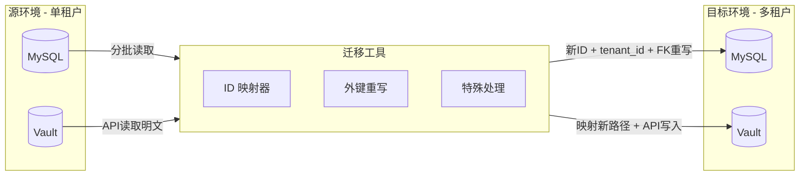
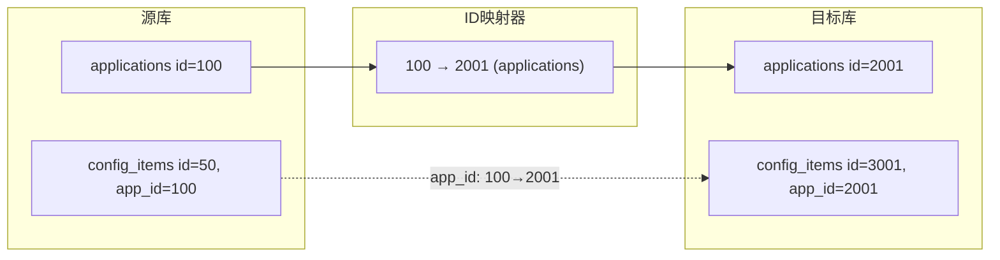
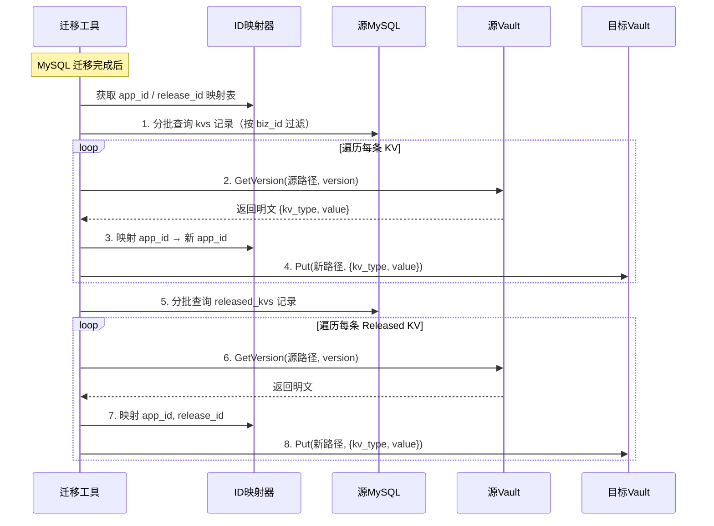
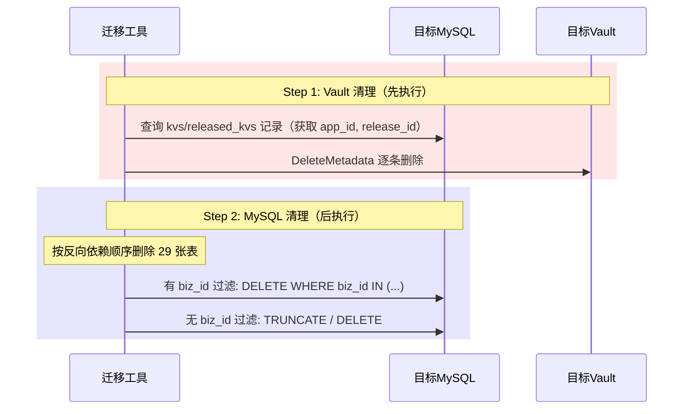
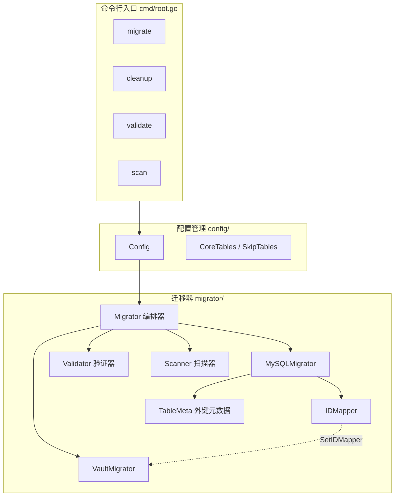
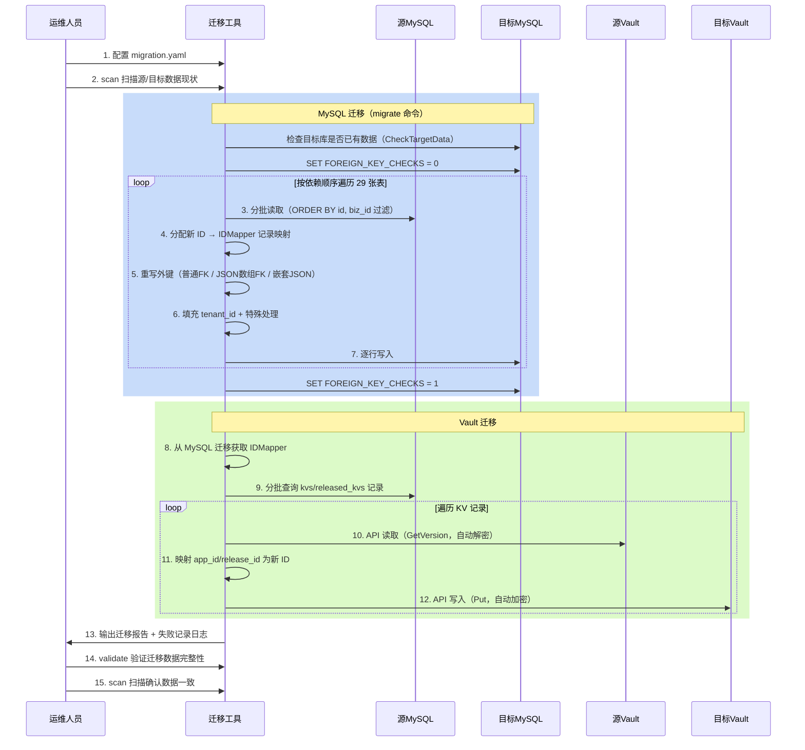
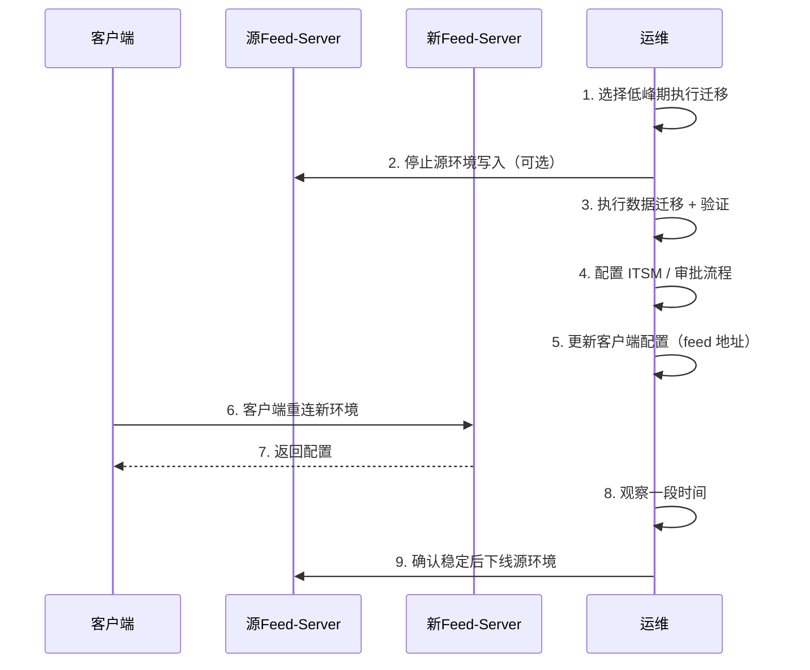

# 单租户到多租户数据迁移方案

## 一、迁移概述


```mermaid
flowchart LR
    subgraph source [源环境 - 单租户]
        MySQL_S[(MySQL)]
        Vault_S[(Vault)]
    end
    
    subgraph tool [迁移工具]
        ID_Mapper[ID 映射器]
        FK_Rewriter[外键重写]
        Special[特殊处理]
    end

    subgraph target [目标环境 - 多租户]
        MySQL_T[(MySQL)]
        Vault_T[(Vault)]
    end
    
    MySQL_S -->|"分批读取"| tool
    tool -->|"新ID + tenant_id + FK重写"| MySQL_T
    Vault_S -->|"API读取明文"| tool
    tool -->|"映射新路径 + API写入"| Vault_T
```

**迁移范围**：

- MySQL：29 张核心业务表，自动分配新 ID、重写外键引用、填充 `tenant_id`
- Vault：KV 配置值数据，通过 API 迁移（两套环境密钥不同），路径中 `app_id` / `release_id` 自动映射为新 ID
- ITSM：迁移时清除审批工单字段，待审批的策略重置为 `pending_approval`，用户在新环境重新发起审批
- 文件存储：跳过（bkrepo/cos 单独处理）

---

## 二、CLI 命令一览

| 命令 | 功能 | 关键参数 |
|------|------|----------|
| `migrate` | 全量迁移（MySQL + Vault） | `--biz-ids`（必填）、`-y` 跳过确认 |
| `cleanup` | 清理目标数据（Vault → MySQL） | `--biz-ids`（可选）、`-f` 跳过确认 |
| `validate` | 验证迁移数据完整性 | — |
| `scan` | 扫描源/目标数据库资产对比 | `--biz-ids`（可选）、`-a` 扫描所有表 |
| `version` | 打印版本信息 | — |

**全局参数**：`-c / --config` 配置文件路径（必填）

```bash
# 编译
go build -o bk-bscp-tenant-migration ./cmd/tenant-migration/

# 迁移指定业务
./bk-bscp-tenant-migration -c migration.yaml migrate --biz-ids=100,200,300

# 清理目标数据（迁移失败后重来）
./bk-bscp-tenant-migration -c migration.yaml cleanup --biz-ids=100,200,300 -f

# 验证迁移结果
./bk-bscp-tenant-migration -c migration.yaml validate

# 扫描资产对比
./bk-bscp-tenant-migration -c migration.yaml scan --biz-ids=100,200,300
./bk-bscp-tenant-migration -c migration.yaml scan --all
```

> **注意**：`migrate` 命令**必须**通过 `--biz-ids` 指定业务 ID，不支持全量迁移模式。

---

## 三、MySQL 数据迁移

### 1. 表分类说明

#### 必须迁移的核心业务表（29 张，按依赖层级）

| 层级 | 表名 | 说明 | 外键依赖 |
|------|------|------|----------|
| L1（基础表） | `sharding_bizs` | 业务分片配置 | 无 |
| | `applications` | 应用定义 | 无 |
| | `template_spaces` | 模板空间 | 无 |
| | `groups` | 分组 | 无 |
| | `hooks` | 前置/后置脚本 | 无 |
| | `credentials` | 服务密钥凭证 | 无 |
| | `template_variables` | 模板变量 | 无 |
| L2（二级表） | `config_items` | 配置项元数据 | → `applications` |
| | `releases` | 发布版本 | → `applications` |
| | `strategy_sets` | 策略集合 | → `applications` |
| | `templates` | 配置模板 | → `template_spaces` |
| | `template_sets` | 模板套餐 | → `template_spaces`；JSON数组: `template_ids` → `templates`, `bound_apps` → `applications` |
| | `hook_revisions` | 脚本版本 | → `hooks` |
| | `credential_scopes` | 凭证作用域 | → `credentials` |
| | `group_app_binds` | 分组应用绑定 | → `groups`, `applications` |
| L3（三级表） | `contents` | 配置内容 | → `applications`, `config_items`(optional) |
| | `commits` | 配置提交 | → `applications`, `config_items`(optional), `contents` |
| | `strategies` | 发布策略 | → `applications`, `releases`, `strategy_sets` |
| | `current_published_strategies` | 当前生效策略 | → `applications`, `strategies`, `releases`, `strategy_sets` |
| | `kvs` | KV 配置元数据 | → `applications` |
| | `released_config_items` | 已发布配置项 | → `applications`, `releases`, `commits`, `config_items`(optional), `contents` |
| | `released_groups` | 已发布分组 | → `applications`, `groups`, `releases`, `strategies` |
| | `released_hooks` | 已发布脚本 | → `applications`, `releases`, `hooks`, `hook_revisions` |
| | `released_kvs` | 已发布 KV | → `applications`, `releases` |
| | `template_revisions` | 模板版本 | → `template_spaces`, `templates` |
| | `app_template_bindings` | 应用模板绑定 | → `applications`；JSON数组: 多个模板相关 ID |
| | `app_template_variables` | 应用模板变量 | → `applications` |
| | `released_app_templates` | 已发布应用模板 | → `applications`, `releases`, `template_spaces`, `template_sets`, `templates`, `template_revisions` |
| | `released_app_template_variables` | 已发布模板变量 | → `applications`, `releases` |

#### 跳过的运行时/历史表（13 张）

| 表名 | 跳过原因 |
|------|----------|
| `events` | 事件通知，系统运行时自动生成 |
| `current_released_instances` | 客户端当前版本记录，重连后自动更新 |
| `resource_locks` | 资源锁，运行时临时数据 |
| `clients` | 客户端连接信息，重连后自动注册 |
| `client_events` | 客户端事件，运行时监控数据 |
| `client_querys` | 客户端查询记录，非核心数据 |
| `audits` | 审计日志，历史记录（可选迁移） |
| `published_strategy_histories` | 发布策略历史（可选迁移） |
| `archived_apps` | 归档应用，已删除的应用 |
| `configs` | ITSM 配置，新环境需重新注册 |
| `schema_migrations` | 数据库迁移记录表 |
| `biz_hosts` | 业务主机关系表，定时同步 |
| `sharding_dbs` | 数据库分片配置 |

### 2. 核心迁移机制

#### 2.1 ID 映射与外键重写

迁移的核心难点在于：目标环境的 `id_generators` 自增序列与源环境不同，因此每条记录在目标库中会获得**新的主键 ID**。所有外键引用必须同步更新为新 ID。


```mermaid
flowchart LR
    subgraph 源库
        A1["applications id=100"]
        C1["config_items id=50, app_id=100"]
    end
    
    subgraph ID映射器
        M["100 → 2001 (applications)"]
    end
    
    subgraph 目标库
        A2["applications id=2001"]
        C2["config_items id=3001, app_id=2001"]
    end
    
    A1 --> M
    M --> A2
    C1 -.->|"app_id: 100→2001"| C2
```

**实现细节**：

- 每行记录通过 `UPDATE id_generators SET max_id = max_id + 1 WHERE resource = ?` 获取新 ID
- `IDMapper` 记录所有 `(表名, 源ID) → 新ID` 的映射关系
- 外键转换时，从 `IDMapper` 查找引用表的新 ID
- 支持三种外键类型：
  - **普通外键**（`ForeignKeys`）：直接列值映射，源 ID 为 0 时跳过
  - **可选外键**（`OptionalFKs`）：映射不到时自动分配虚拟 ID（不插入父表记录），适用于可能已删除的引用（如 `config_item_id`）
  - **JSON 数组外键**（`JSONArrayFKs`）：解析 JSON 数组中的每个 ID 并替换（如 `template_sets.template_ids`）
- 特殊处理 `app_template_bindings.bindings` 嵌套 JSON 结构中的多层 ID 映射

#### 2.2 Biz_id 过滤

- 有 `biz_id` 列的表：`WHERE biz_id IN (?)` 只读取/清理指定业务的数据
- 无 `biz_id` 列的表（如 `sharding_bizs`）：迁移时**全量复制**

#### 2.3 特殊处理

| 表名 | 特殊处理 | 说明 |
|------|----------|------|
| `strategies` | `itsm_ticket_state_id` int → string | 目标库字段类型变更 |
| `strategies` | 清除 ITSM 审批字段 | 跨环境审批单不互通，详见下文 |
| `kvs` / `released_kvs` | `version` 重置为 1 | Vault KV v2 的 Put 操作会重置版本号 |
| 所有表 | 填充 `tenant_id` | 目标表已有此字段，填充配置的 `target_tenant_id` |
| `app_template_bindings` | `bindings` JSON 嵌套 ID 重写 | 包含 template_set_id, template_revision_id 等多层引用 |

#### 2.4 ITSM 审批字段处理

跨环境迁移时，源环境的 ITSM 审批工单无法在目标环境使用：

- 工单 SN 属于源 ITSM 实例，在目标 ITSM 中不存在
- 审批回调 URL 指向源环境的 BSCP 网关
- 目标环境的 ITSM 工作流/服务/状态 ID 配置不同

**迁移策略**：

| 原始状态 | 迁移后处理 |
|----------|-----------|
| `pending_approval` / `pending_publish` | 重置为 `revoked_publish`（已撤销），清除 ITSM 字段和 `approver_progress` |
| `already_publish` / `rejected_approval` 等 | **不做任何处理**，保留全部字段原值 |

> **为什么只处理待审批/待上线的策略？**
> - 已完成的策略（`already_publish` 等）：页面不会展示 ITSM 审批信息（`approveStatus = -1`，组件不渲染），保留原始记录无害且保持审计可追溯性。
>
> **为什么待审批的改为 `revoked_publish` 而非保留 `pending_approval`？**
> 1. 保持 `pending_approval` 会**阻塞该应用的新上线操作**（代码检查到有待审批策略时拒绝新提交）
> 2. 页面会常驻显示"待审批"旋转图标，但没有审批单链接，用户无法操作
> 3. `revoked_publish` 不会阻塞新发布，且在页面刷新后自动消失，用户可以正常重新提交上线

#### 2.5 错误处理

- **`continue_on_error: false`（默认）**：遇到第一个失败记录即停止当前表的迁移
- **`continue_on_error: true`**：跳过失败记录继续迁移，累计错误计数
- 失败记录详情写入日志文件 `logs/biz_<ids>/migrate_<timestamp>.json`，按 `biz_id` 分组
- 迁移报告中展示每张表的源数据量、已迁移量、失败量和状态

### 3. 迁移顺序

迁移工具通过 `TablesInInsertOrder()` 严格按依赖顺序迁移，确保外键引用的目标记录已存在：

```
第一批（基础表）: sharding_bizs → applications → template_spaces → groups → hooks → credentials → template_variables
        ↓
第二批（二级表）: config_items → releases → strategy_sets → templates → template_sets → hook_revisions → credential_scopes → group_app_binds
        ↓
第三批（依赖表）: contents → commits → strategies → current_published_strategies → kvs → released_* → template_revisions → app_template_* → released_app_*
```

清理时使用 `TablesInCleanupOrder()` 按**反向依赖顺序**删除，先删三级表再删基础表。

---

## 四、Vault KV 数据迁移

### 1. 关键约束

两套环境的 Vault 使用不同的加密密钥（unseal key），因此：

- **不能**直接复制 Vault 底层存储数据
- 必须通过 Vault API 读取解密后的明文数据
- 再通过 API 写入目标 Vault（目标 Vault 用自己的密钥重新加密）

### 2. 存储路径与 ID 映射

Vault KV 路径中包含 `app_id` 和 `release_id`，迁移时需使用 MySQL 阶段生成的 ID 映射进行路径重写：

```
源路径: bk_bscp/biz/{biz_id}/apps/{源app_id}/kvs/{key}
目标路径: bk_bscp/biz/{biz_id}/apps/{新app_id}/kvs/{key}

源路径: bk_bscp/biz/{biz_id}/apps/{源app_id}/releases/{源release_id}/kvs/{key}
目标路径: bk_bscp/biz/{biz_id}/apps/{新app_id}/releases/{新release_id}/kvs/{key}
```

### 3. 迁移流程


```mermaid
sequenceDiagram
    participant Tool as 迁移工具
    participant IDMap as ID映射器
    participant SrcDB as 源MySQL
    participant SrcVault as 源Vault
    participant TgtVault as 目标Vault

    Note over Tool: MySQL 迁移完成后
    Tool->>IDMap: 获取 app_id / release_id 映射表
    Tool->>SrcDB: 1. 分批查询 kvs 记录（按 biz_id 过滤）
    loop 遍历每条 KV
        Tool->>SrcVault: 2. GetVersion(源路径, version)
        SrcVault-->>Tool: 返回明文 {kv_type, value}
        Tool->>IDMap: 3. 映射 app_id → 新 app_id
        Tool->>TgtVault: 4. Put(新路径, {kv_type, value})
    end
    Tool->>SrcDB: 5. 分批查询 released_kvs 记录
    loop 遍历每条 Released KV
        Tool->>SrcVault: 6. GetVersion(源路径, version)
        SrcVault-->>Tool: 返回明文
        Tool->>IDMap: 7. 映射 app_id, release_id
        Tool->>TgtVault: 8. Put(新路径, {kv_type, value})
    end
```

### 4. 注意事项

- **版本重置**：Vault KV v2 的 `Put` 操作会重置版本为 1，因此 MySQL 中 `kvs.version` 和 `released_kvs.version` 也同步重置为 1
- **超时控制**：Vault 迁移设置 30 分钟超时（context）
- **错误处理**：`continue_on_error` 配置同时适用于 Vault 迁移
- **签名校验**：`kvs` 表中的 `signature` 字段可用于验证迁移后数据完整性

---

## 五、清理机制

清理（cleanup）用于迁移失败后重新执行前清除目标数据。

**执行顺序**：Vault 先于 MySQL，因为 Vault 清理需要读取目标 MySQL 中的记录来构建正确的 Vault 路径。


```mermaid
sequenceDiagram
    participant Tool as 迁移工具
    participant TgtDB as 目标MySQL
    participant TgtVault as 目标Vault

    rect rgb(255, 230, 230)
        Note over Tool,TgtVault: Step 1: Vault 清理（先执行）
        Tool->>TgtDB: 查询 kvs/released_kvs 记录（获取 app_id, release_id）
        Tool->>TgtVault: DeleteMetadata 逐条删除
    end
    
    rect rgb(230, 230, 255)
        Note over Tool,TgtDB: Step 2: MySQL 清理（后执行）
        Note over Tool: 按反向依赖顺序删除 29 张表
        Tool->>TgtDB: 有 biz_id 过滤: DELETE WHERE biz_id IN (...)
        Tool->>TgtDB: 无 biz_id 过滤: TRUNCATE / DELETE
    end
```

---

## 六、验证与扫描

### 1. 验证（validate）

对 29 张核心表逐一检查：

| 检查项 | 说明 |
|--------|------|
| 记录数对比 | 源库 vs 目标库记录数（按 biz_id 过滤） |
| tenant_id 完整性 | 检查目标库中 tenant_id 为 NULL 或空的记录 |
| tenant_id 正确性 | 检查 tenant_id 不等于配置值的记录 |

### 2. 扫描（scan）

资产扫描用于了解迁移前后的数据分布：

- **默认模式**：只扫描配置的迁移表（`tables` 列表）
- **`--all` 模式**：扫描源/目标数据库中的所有表
- 输出源/目标库各表记录数及差异对比
- 如配置了 Vault，额外扫描 Vault KV 数据（与 MySQL 记录交叉验证存在性）

---

## 七、迁移工具架构


```mermaid
flowchart TB
    subgraph CLI [命令行入口 cmd/root.go]
        migrate_cmd[migrate]
        cleanup_cmd[cleanup]
        validate_cmd[validate]
        scan_cmd[scan]
    end
    
    subgraph config [配置管理 config/]
        cfg[Config]
        table_list[CoreTables / SkipTables]
    end
    
    subgraph migrator_pkg [迁移器 migrator/]
        orchestrator[Migrator 编排器]
        mysql_m[MySQLMigrator]
        vault_m[VaultMigrator]
        id_mapper[IDMapper]
        table_meta[TableMeta 外键元数据]
        validator[Validator 验证器]
        scanner[Scanner 扫描器]
    end
    
    CLI --> cfg
    cfg --> orchestrator
    orchestrator --> mysql_m
    orchestrator --> vault_m
    orchestrator --> validator
    orchestrator --> scanner
    mysql_m --> id_mapper
    mysql_m --> table_meta
    id_mapper -.->|"SetIDMapper"| vault_m
```

### 核心模块说明

| 模块 | 文件 | 职责 |
|------|------|------|
| 编排器 | `migrator.go` | 协调 MySQL → Vault 迁移流程，汇总报告 |
| MySQL 迁移器 | `mysql.go` | 分批读取、ID 分配、FK 重写、特殊处理、写入目标库 |
| Vault 迁移器 | `vault.go` | API 读源写目标，路径中 ID 映射 |
| 表元数据 | `table_meta.go` | 29 张表的 FK 关系、插入/清理顺序定义 |
| ID 映射器 | `id_mapper.go` | 线程安全的 `(表名, 源ID) → 新ID` 映射 |
| 验证器 | `validator.go` | 迁移后记录数、tenant_id 完整性检查 |
| 扫描器 | `scanner.go` | 源/目标资产对比，Vault 交叉验证 |

---

## 八、配置文件说明

```yaml
migration:
  # 目标租户 ID，将填充到所有迁移记录的 tenant_id 字段
  target_tenant_id: "10001"
  
  # 要迁移的业务 ID（配置文件设置，可被 --biz-ids 命令行参数覆盖）
  # biz_ids:
  #   - 100
  #   - 200

  # 每批处理的记录数（默认 1000）
  batch_size: 1000
  
  # 遇错继续（默认 false，遇到失败记录即停止）
  continue_on_error: false

# 源环境配置
source:
  mysql:
    endpoints:
      - "source-mysql:3306"
    database: "bk_bscp"
    user: "root"
    password: "xxx"
  vault:
    address: "http://source-vault:8200"
    token: "xxx"

# 目标环境配置
target:
  mysql:
    endpoints:
      - "target-mysql:3306"
    database: "bk_bscp"
    user: "root"
    password: "xxx"
  vault:
    address: "http://target-vault:8200"
    token: "xxx"

# 跳过的表（运行时/历史数据，使用默认列表即可）
skip_tables:
  - events
  - current_released_instances
  - resource_locks
  - clients
  - client_events
  - client_querys
  - audits
  - published_strategy_histories
  - archived_apps
  - configs                     # ITSM 配置，新环境重新注册
  - schema_migrations
  - biz_hosts
  - sharding_dbs
```

| 配置项 | 必填 | 默认值 | 说明 |
|--------|------|--------|------|
| `migration.target_tenant_id` | 是 | — | 目标租户 ID |
| `migration.biz_ids` | 否 | 空（需 `--biz-ids`） | 要迁移的业务 ID 列表 |
| `migration.batch_size` | 否 | 1000 | 每批处理记录数 |
| `migration.continue_on_error` | 否 | false | 遇错是否继续 |
| `source.mysql.*` | 是 | — | 源 MySQL 连接配置 |
| `source.vault.*` | 否 | — | 源 Vault 配置（迁移 KV 时必填） |
| `target.mysql.*` | 是 | — | 目标 MySQL 连接配置 |
| `target.vault.*` | 否 | — | 目标 Vault 配置（迁移 KV 时必填） |
| `skip_tables` | 否 | 13 张默认表 | 跳过的表列表 |

---

## 九、迁移执行流程


```mermaid
sequenceDiagram
    participant Op as 运维人员
    participant Tool as 迁移工具
    participant SrcMySQL as 源MySQL
    participant TgtMySQL as 目标MySQL
    participant SrcVault as 源Vault
    participant TgtVault as 目标Vault

    Op->>Tool: 1. 配置 migration.yaml
    Op->>Tool: 2. scan 扫描源/目标数据现状

    rect rgb(200, 220, 250)
        Note over Tool,TgtMySQL: MySQL 迁移（migrate 命令）
        Tool->>TgtMySQL: 检查目标库是否已有数据（CheckTargetData）
        Tool->>TgtMySQL: SET FOREIGN_KEY_CHECKS = 0
        loop 按依赖顺序遍历 29 张表
            Tool->>SrcMySQL: 3. 分批读取（ORDER BY id, biz_id 过滤）
            Tool->>Tool: 4. 分配新 ID → IDMapper 记录映射
            Tool->>Tool: 5. 重写外键（普通FK / JSON数组FK / 嵌套JSON）
            Tool->>Tool: 6. 填充 tenant_id + 特殊处理
            Tool->>TgtMySQL: 7. 逐行写入
        end
        Tool->>TgtMySQL: SET FOREIGN_KEY_CHECKS = 1
    end

    rect rgb(220, 250, 200)
        Note over Tool,TgtVault: Vault 迁移
        Tool->>Tool: 8. 从 MySQL 迁移获取 IDMapper
        Tool->>SrcMySQL: 9. 分批查询 kvs/released_kvs 记录
        loop 遍历 KV 记录
            Tool->>SrcVault: 10. API 读取（GetVersion，自动解密）
            Tool->>Tool: 11. 映射 app_id/release_id 为新 ID
            Tool->>TgtVault: 12. API 写入（Put，自动加密）
        end
    end

    Tool->>Op: 13. 输出迁移报告 + 失败记录日志

    Op->>Tool: 14. validate 验证迁移数据完整性
    Op->>Tool: 15. scan 扫描确认数据一致
```

### 执行步骤

#### 1. 准备阶段

- 停止源环境写入（或选择低峰期迁移窗口）
- 备份目标环境数据库
- 确认迁移机器可访问源/目标的 MySQL 和 Vault
- 确认 MySQL 用户有读写权限，Vault Token 有 KV 读写权限
- 准备配置文件 `migration.yaml`

#### 2. 扫描（可选）

```bash
./bk-bscp-tenant-migration -c migration.yaml scan --biz-ids=100,200
```

了解源/目标数据分布，确认迁移范围。

#### 3. 执行迁移

```bash
./bk-bscp-tenant-migration -c migration.yaml migrate --biz-ids=100,200
```

工具自动执行：
- 检查目标库是否已有该业务数据（有则要求先 cleanup）
- 交互式确认（`-y` 跳过）
- MySQL 分表迁移（ID 映射 + FK 重写 + 特殊处理）
- Vault KV 迁移（API 方式，路径中 ID 自动映射）
- 输出迁移报告（各表数量、成功/失败状态）
- 失败记录写入日志文件

#### 4. 验证

```bash
./bk-bscp-tenant-migration -c migration.yaml validate
```

自动对比 29 张核心表的记录数和 tenant_id 完整性。

#### 5. ITSM 配置（迁移完成后手动执行）

- 在目标环境执行 ITSM v4 服务注册
- 配置审批流程（`configs` 表中的 ITSM workflow/service/state ID）
- 用户对待审批的策略重新发起审批

---

## 十、不迁移表的影响分析

| 表名 | 不迁移影响 | 风险等级 |
|------|-----------|---------|
| `events` | 无历史事件，不影响新发布 | 低 |
| `current_released_instances` | 客户端重连后自动更新 | 无 |
| `clients` | 客户端重连后自动注册 | 无 |
| `client_events` | 丢失历史监控数据 | 低 |
| `client_querys` | 需要在新环境重新创建 | 低 |
| `resource_locks` | 运行时临时数据 | 无 |
| `audits` | 丢失历史操作记录 | 中（可选迁移） |
| `published_strategy_histories` | 丢失历史发布记录 | 低（可选迁移） |
| `configs` | ITSM 配置需重新注册 | 中（必须手动配置） |

**结论**：上述表不迁移**不会影响核心业务功能**，客户端可以正常拉取配置。

---

## 十一、BkRepo 文件存储分析

### 存储路径结构

```
/generic/{project}/bscp-{version}-{biz_id}/file/{sha256}
```

- 文件按 **sha256 签名** 存储（内容寻址）
- 路径中**不包含 tenant_id**
- 同一文件（相同 sha256）只存储一份

### 是否需要迁移

| 场景 | 是否需要迁移 |
|------|-------------|
| 两套环境共用同一个 BkRepo，且 project 相同 | **无需迁移** |
| 两套环境使用不同的 BkRepo 实例 | **需要迁移**文件内容 |
| 同一 BkRepo 但 project 不同 | **需要迁移**或复制文件到新 project |

**推荐**：让两套环境共用同一个 BkRepo（相同 project），这样文件无需迁移。

---

## 十二、双环境并行运行

### 切换流程


```mermaid
sequenceDiagram
    participant Client as 客户端
    participant OldFeed as 源Feed-Server
    participant NewFeed as 新Feed-Server
    participant Admin as 运维

    Admin->>Admin: 1. 选择低峰期执行迁移
    Admin->>OldFeed: 2. 停止源环境写入（可选）
    Admin->>Admin: 3. 执行数据迁移 + 验证
    Admin->>Admin: 4. 配置 ITSM / 审批流程
    Admin->>Admin: 5. 更新客户端配置（feed 地址）
    Client->>NewFeed: 6. 客户端重连新环境
    NewFeed-->>Client: 7. 返回配置
    Admin->>Admin: 8. 观察一段时间
    Admin->>OldFeed: 9. 确认稳定后下线源环境
```

### 风险与应对

| 风险 | 应对措施 |
|------|---------|
| 切换期间源环境有新发布 | 迁移时选择停服窗口，或迁移后在新环境同步发布 |
| 客户端 SDK 版本兼容性 | 提前测试验证客户端 SDK 版本兼容性 |
| 客户端切换瞬间拉取失败 | 客户端有重试机制，短暂失败可自动恢复 |
| 回滚困难 | 保留源环境一段时间，确认稳定后再下线 |

---

## 十三、迁移后验证清单

### 数据验证

- [ ] `validate` 命令通过（29 张核心表记录数一致、tenant_id 完整）
- [ ] `scan` 命令对比源/目标数据无异常差异
- [ ] Vault KV 数据完整（kvs / released_kvs 与 Vault 交叉验证）
- [ ] `id_generators` 表 max_id 已正确更新

### 功能验证

- [ ] 应用列表正常显示
- [ ] 配置项 / KV 配置可正常查看
- [ ] 发布版本数据完整
- [ ] 模板、分组、钩子、凭证数据正常
- [ ] ITSM v4 服务已注册（如需审批功能）
- [ ] 待审批策略可正常重新发起审批

### 客户端切换验证

- [ ] 测试客户端连接新 feed-server 成功
- [ ] 测试客户端拉取配置正常
- [ ] 验证配置内容与源环境一致
- [ ] 监控客户端连接数恢复正常
- [ ] 验证新发布流程正常工作
