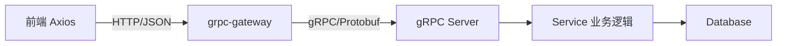
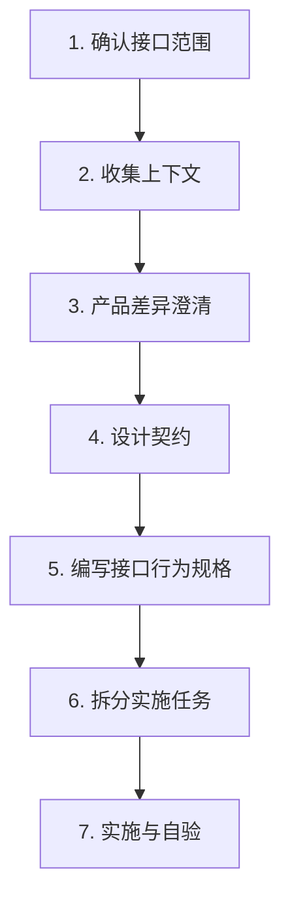

# 前后端接口规范

> 通用前后端接口协作规范文档，适用于 Protobuf + gRPC-Gateway + 前端 Axios 的全栈项目。

---

## 一、架构概述

### 1.1 请求链路



### 1.2 技术栈分工

| 层级 | 技术 | 职责 |
|------|------|------|
| 接口定义 | Protobuf 3 | 单一事实源，定义所有 API |
| 后端服务 | Go + go-micro + gRPC | 实现业务逻辑 |
| HTTP 转换 | grpc-gateway v2 | Proto → RESTful HTTP API |
| 前端请求 | Axios + TypeScript | 类型安全的 HTTP 调用 |

### 1.3 前端三层代码架构

```
web/src/
├── services/generated/   # Proto 自动生成的 TypeScript SDK
│                          # ⚠️ 禁止手动修改
├── services/             # 桥接层（手写）
│   └── {module}.ts       # 封装 generated、类型转换、错误处理
└── types/                # 类型定义（手写）
    └── {module}.ts       # 重导 generated 类型 + 语义化别名
```

---

## 二、接口定义规范（Proto）

### 2.1 文件组织

```
api/proto/
└── {module}/
    └── {module}.proto    # 每个业务模块一个 proto 文件
```

### 2.2 命名约定

| 元素 | 规则 | 示例 |
|------|------|------|
| Package | 小写模块名 | `user`, `order` |
| Service | `{Module}Service` | `UserService` |
| RPC 方法 | `{Action}{Resource}` | `CreateUser`, `ListOrders` |
| Request | `{Action}{Resource}Request` | `CreateUserRequest` |
| Response | `{Action}{Resource}Response` | `CreateUserResponse` |
| 字段 | snake_case | `user_id`, `created_at` |

### 2.3 HTTP 映射标准

```protobuf
service UserService {
  // CreateUser 创建用户
  rpc CreateUser(CreateUserRequest) returns (CreateUserResponse) {
    option (google.api.http) = {
      post: "/api/v1/users"
      body: "*"
    };
  }

  // GetUser 获取用户详情
  rpc GetUser(GetUserRequest) returns (GetUserResponse) {
    option (google.api.http) = {
      get: "/api/v1/users/{user_id}"
    };
  }

  // ListUsers 获取用户列表
  rpc ListUsers(ListUsersRequest) returns (ListUsersResponse) {
    option (google.api.http) = {
      get: "/api/v1/users"
    };
  }

  // UpdateUser 更新用户
  rpc UpdateUser(UpdateUserRequest) returns (UpdateUserResponse) {
    option (google.api.http) = {
      put: "/api/v1/users/{user_id}"
      body: "*"
    };
  }

  // DeleteUser 删除用户
  rpc DeleteUser(DeleteUserRequest) returns (DeleteUserResponse) {
    option (google.api.http) = {
      delete: "/api/v1/users/{user_id}"
    };
  }
}
```

### 2.4 URL 设计规则

| 规则 | 说明 | 示例 |
|------|------|------|
| 资源用名词复数 | RESTful 风格 | `/api/v1/users` |
| 层级不超过 3 层 | 保持简洁 | `/api/v1/groups/{id}/members` |
| 路径参数用 `{field_name}` | 与 message 字段对应 | `/{user_id}` |
| 版本号在路径中 | 方便迁移 | `/api/v1/`, `/api/v2/` |
| 自定义操作用动词 | 非 CRUD 操作 | `/api/v1/users/{id}:activate` |

---

## 三、数据类型映射

### 3.1 Proto → JSON → TypeScript 类型映射

| Proto 类型 | JSON 序列化 | TypeScript 类型 | 注意事项 |
|-----------|------------|----------------|---------|
| `int32` | number | `number` | 安全范围内 |
| `int64` | **string** | `string \| number` | ⚠️ 防精度丢失 |
| `uint64` | **string** | `string \| number` | ⚠️ 防精度丢失 |
| `float` | number | `number` | |
| `double` | number | `number` | |
| `bool` | boolean | `boolean` | |
| `string` | string | `string` | |
| `bytes` | base64 string | `string` | |
| `repeated T` | array | `T[]` | |
| `map<K,V>` | object | `Record<K, V>` | |
| `Timestamp` | RFC3339 string | `string` | `"2024-01-01T00:00:00Z"` |
| `message` | object | `interface` | 嵌套对象 |
| `enum` | number (默认) / string | `number \| string` | 推荐用 string 映射 |
| `optional T` | T \| null | `T \| undefined` | |

### 3.2 ⚠️ int64 陷阱（最常见问题）

**问题：** gRPC-Gateway 将 `int64`/`uint64` 序列化为 JSON **字符串**（防止 JavaScript 精度丢失）。

**前端解决方案：**

```typescript
// 工具函数：兼容 number | string
function toNumber(value: number | string): number {
  return typeof value === 'string' ? Number(value) : value;
}

// 使用时
const id = toNumber(response.id); // 可能是 "12345" 或 12345
```

**规则：** 前端桥接层中所有 `int64` 字段必须用 coerce 函数处理。

---

## 四、响应格式规范

### 4.1 标准响应格式

**推荐格式（新版协议）：**

```json
{
  "data": {
    "id": "123",
    "name": "示例"
  }
}
```

**兼容格式（旧版协议）：**

```json
{
  "code": 0,
  "message": "success",
  "data": {
    "id": "123",
    "name": "示例"
  }
}
```

### 4.2 错误响应格式

```json
{
  "code": 400,
  "message": "参数错误：name 不能为空",
  "details": [
    {
      "field": "name",
      "reason": "不能为空"
    }
  ]
}
```

### 4.3 前端拦截器处理

```typescript
// 响应拦截器统一剥壳
http.interceptors.response.use(
  (res) => {
    const { data } = res;
    // 兼容旧版协议
    if (data.code !== undefined) {
      if (data.code !== 0) {
        showError(data.message);
        return Promise.reject(new Error(data.message));
      }
      return data.data;
    }
    // 新版协议
    return data.data ?? data;
  },
  (error) => {
    const status = error.response?.status;
    if (status === 401) redirectToLogin();
    if (status === 403) showError('无权限');
    if (status >= 500) showError('服务器错误，请稍后重试');
    return Promise.reject(error);
  }
);
```

**规则：** 业务代码直接拿到 `data` 字段的内容，不需要手动剥壳。

---

## 五、前端接入规范

### 5.1 三层架构职责

| 层级 | 文件位置 | 职责 | 修改规则 |
|------|---------|------|---------|
| Generated 层 | `services/generated/{module}/` | Proto 的 TypeScript 镜像 | ❌ 禁止手改 |
| Bridge 层 | `services/{module}.ts` | 封装调用、类型转换、缓存 | ✅ 可修改 |
| Types 层 | `types/{module}.ts` | 类型重导出 + 语义化别名 | ✅ 可修改 |

### 5.2 Bridge 层标准写法

```typescript
// services/user.ts
import { userApi } from './generated/user/api';
import type { UserInfo } from './generated/user/types';
import type { UserItem } from '@/types/user';

/**
 * 获取用户列表
 */
export async function listUsers(params: {
  page: number;
  pageSize: number;
  keyword?: string;
}): Promise<{ list: UserItem[]; total: number }> {
  const resp = await userApi.listUsers({
    page: params.page,
    page_size: params.pageSize,   // camelCase → snake_case
    keyword: params.keyword ?? '',
  });

  return {
    list: resp.items.map(normalizeUser),  // 类型转换
    total: toNumber(resp.total),           // int64 coerce
  };
}

/**
 * 标准化用户数据（generated → 前端友好类型）
 */
function normalizeUser(raw: UserInfo): UserItem {
  return {
    id: toNumber(raw.id),
    name: raw.name,
    status: raw.status,
    createdAt: raw.created_at,
  };
}
```

### 5.3 Types 层标准写法

```typescript
// types/user.ts
// 重导出 generated 类型（方便页面直接引用）
export type { UserInfo } from '@/services/generated/user/types';

// 语义化别名（前端友好命名）
export interface UserItem {
  id: number;
  name: string;
  status: UserStatus;
  createdAt: string;
}

// 状态枚举
export type UserStatus = 'active' | 'inactive' | 'banned';

// 扩展配置类型（用于 JSON 扩展字段）
export interface UserExtraConfig {
  version: string;
  preferences?: {
    theme: string;
    language: string;
  };
}
```

### 5.4 命名约定

| 操作 | Bridge 函数名 | HTTP 方法 |
|------|-------------|----------|
| 列表查询 | `list{Resource}s` | GET |
| 单个查询 | `get{Resource}` | GET |
| 创建 | `create{Resource}` | POST |
| 更新 | `update{Resource}` | PUT |
| 删除 | `delete{Resource}` | DELETE |
| 自定义操作 | `{action}{Resource}` | POST |

---

## 六、核心契约模式

### 6.1 状态归一化

**问题：** 后端可能有 8+ 种精细状态，产品 UI 只需 3~4 种展示分类。

**解决方案：双层映射**

```typescript
// types/common.ts

// 原始状态（保留全部后端状态，用于操作按钮可用性判断）
type RawStatus = 'creating' | 'running' | 'stopping' | 'stopped' | 'error' | 'deleting' | 'deleted' | 'unknown';

// 展示状态（归一化后的 UI 展示分类）
type DisplayStatus = 'running' | 'stopped' | 'error';

// 映射函数
function normalizeStatus(raw: RawStatus): DisplayStatus {
  const map: Record<RawStatus, DisplayStatus> = {
    creating: 'running',
    running: 'running',
    stopping: 'stopped',
    stopped: 'stopped',
    error: 'error',
    deleting: 'stopped',
    deleted: 'stopped',
    unknown: 'error',
  };
  return map[raw] ?? 'error';
}
```

**规则：**
- 展示用归一化状态（颜色、图标）
- 操作判断用原始状态（按钮禁用/可用）
- 映射表集中维护，禁止在页面中散落 `if/else`

### 6.2 扩展配置字段（extra_config 模式）

**场景：** Proto 字段不够装产品表单的全部信息时，使用 JSON 字符串字段扩展。

```protobuf
message ResourceInfo {
  string id = 1;
  string name = 2;
  string extra_config = 10;  // JSON 字符串，扩展配置
}
```

**前端契约：**

```typescript
interface ExtraConfig {
  version: string;           // 契约版本号（必须）
  deploy?: {                 // 业务子模块
    framework: string;
    replicas: number;
  };
  display?: {                // 冗余展示字段（兜底用）
    creator_name: string;
  };
}

// 安全解析（try/catch + 默认值）
function parseExtraConfig(json: string): ExtraConfig {
  try {
    return JSON.parse(json);
  } catch {
    return { version: '1.0' };
  }
}
```

**规则：**
- 必须包含 `version` 字段用于兼容性判断
- 解析必须 `try/catch`，提供默认值兜底
- `display` 子对象用于后端未返回字段时的 UI 兜底

### 6.3 跨页跳转参数契约

**标准格式：**

```
/target-page?{resource}_id={id}&context_code={code}
```

**规则：**
- 参数名项目内统一，不随意变更
- 必传参数：资源唯一标识 + 上下文标识
- 接收页面做参数校验，缺失时显示空态

```typescript
// 跳转
router.push({
  path: '/resource/detail',
  query: {
    resource_id: item.id,
    context_code: currentContext.code,
  },
});

// 接收
const route = useRoute();
const resourceId = route.query.resource_id as string;
if (!resourceId) {
  showEmptyState();
  return;
}
```

### 6.4 权限控制模式

```typescript
// composables/usePermission.ts
export function usePermission() {
  const userStore = useUserStore();

  /**
   * 判断当前用户是否可以操作某资源
   */
  function canOperate(resource: { creator: string; context_code: string }): boolean {
    const role = getMyRole(resource.context_code);
    return role === 'admin' || resource.creator === userStore.username;
  }

  function getMyRole(contextCode: string): string {
    return contextStore.contexts[contextCode]?.my_role ?? 'viewer';
  }

  return { canOperate, getMyRole };
}
```

**规则：**
- 权限判断封装为 composable，统一复用
- 禁止在每个页面重复写权限逻辑
- 避免调用可能 403 的"获取成员列表"接口来判断权限

### 6.5 轮询与数据刷新策略

```typescript
// composables/usePolling.ts
export function usePolling(fn: () => Promise<void>, interval = 30000) {
  let timer: number | null = null;

  const start = () => {
    stop();
    timer = window.setInterval(fn, interval);
  };

  const stop = () => {
    if (timer) {
      clearInterval(timer);
      timer = null;
    }
  };

  // 页面可见性感知
  const handleVisibility = () => {
    document.hidden ? stop() : start();
  };

  onMounted(() => {
    start();
    document.addEventListener('visibilitychange', handleVisibility);
  });

  onUnmounted(() => {
    stop();
    document.removeEventListener('visibilitychange', handleVisibility);
  });

  return { start, stop };
}
```

**规则：**
- 默认轮询间隔 30 秒
- 操作成功后立即刷新一次（不等轮询）
- 页面不可见时停止轮询，可见时恢复
- 上下文切换时重新触发加载

### 6.6 乐观 UI 模式

**场景：** 用户执行操作后，后端异步处理，状态不会立即变化。

```typescript
async function handleStop(item: ResourceItem) {
  // 1. 乐观更新 UI
  item.status = 'stopping';

  try {
    // 2. 发送请求
    await resourceService.stop(item.id);

    // 3. 操作成功提示
    showSuccess('停止指令已发送');

    // 4. 立即刷新一次（获取最新状态）
    await loadData();
  } catch (error) {
    // 5. 失败回滚
    item.status = previousStatus;
    showError('操作失败');
  }
}
```

---

## 七、联调标准流程

### 7.1 流程概览



### 7.2 各步骤说明

| 步骤 | 目标 | 产出 |
|------|------|------|
| 1. 确认范围 | 明确涉及哪些 RPC、哪些页面 | 范围清单 |
| 2. 收集上下文 | 并行查看 Proto、SDK、旧代码、页面 | 上下文文档 |
| 3. 产品差异澄清 | 产品需求 vs 后端能力的差距 | 差异清单 |
| 4. 设计契约 | 状态映射、扩展字段、跳转参数等 | 设计文档 |
| 5. 行为规格 | 每个 RPC/流程的 Given/When/Then | Spec 文档 |
| 6. 任务拆分 | 按 types → services → pages 顺序 | 任务清单 |
| 7. 实施自验 | 编码 + 三件套验证 | 可运行代码 |

### 7.3 前置约束

| 约束 | 说明 |
|------|------|
| 零后端改动 | 前端联调不修改 Proto 和后端代码，能力缺口列入 Follow-up |
| 不改 Generated | 自动生成代码禁止手改，有问题重新生成 |
| 旧实现标 deprecated | 旧函数加 `@deprecated` 标记，不直接删除 |
| 三件套自验 | `vue-tsc + vitest + build` 每轮必过 |

### 7.4 完工标准

- [ ] 类型检查通过（`vue-tsc --noEmit`）
- [ ] 单元测试通过（`vitest run`）
- [ ] 构建通过（`npm run build`）
- [ ] 所有行为规格场景手工验证通过
- [ ] 全局搜索旧符号仅剩 `@deprecated` 引用
- [ ] 差异清单和 Follow-up 事项已记录

---

## 八、API 网关配置规范

### 8.1 配置文件结构

```yaml
# bk_apigw_resources.yaml
- path: /api/v1/users
  method: GET
  operationId: list_users
  description: 获取用户列表
  labels:
    - 用户管理
  backend:
    method: GET
    path: /api/v1/users
  auth:
    required: true

- path: /api/v1/users/{user_id}
  method: GET
  operationId: get_user
  description: 获取用户详情
  labels:
    - 用户管理
  backend:
    method: GET
    path: /api/v1/users/{user_id}
  auth:
    required: true
```

### 8.2 关键规则

| 规则 | 说明 |
|------|------|
| operationId 用 snake_case | `list_users` 而不是 `listUsers` |
| backend 路径与前端一致 | 前后端使用相同 URL |
| 路径参数直接使用 proto 字段名 | `{user_id}` 对应 message 中的字段 |
| 文档文件名 = operationId | `list_users.md` |

### 8.3 API 文档模板

```markdown
# {操作描述}

## 请求参数

### 路径参数

| 参数 | 类型 | 必选 | 描述 |
|------|------|------|------|
| user_id | string | 是 | 用户 ID |

### 查询参数

| 参数 | 类型 | 必选 | 描述 |
|------|------|------|------|
| page | int64 | 否 | 页码，默认 1 |
| page_size | int64 | 否 | 每页数量，默认 20 |

## 响应示例

```json
{
  "data": {
    "items": [...],
    "total": 100
  }
}
```
```

---

## 九、常见陷阱与解决方案

| # | 陷阱 | 原因 | 解决方案 |
|---|------|------|---------|
| 1 | int64 前端精度丢失 | gRPC-Gateway JSON 序列化为 string | Bridge 层用 `toNumber()` coerce |
| 2 | 401/403 Toast 刷屏 | 并发请求都触发错误提示 | 去重 + 只提示一次 |
| 3 | 后端操作后状态不更新 | 异步任务未完成 | 乐观 UI + 轮询兜底 |
| 4 | snake_case/camelCase 混乱 | Proto 是 snake，前端习惯 camel | Bridge 层统一转换 |
| 5 | repeated 字段为 null | Proto 空数组不序列化 | 前端兜底 `?? []` |
| 6 | enum 值为 0 有歧义 | Proto enum 默认值是 0 | 0 值定义为 UNSPECIFIED |
| 7 | Timestamp 时区问题 | UTC vs 本地时间 | 统一用 UTC，前端展示时转换 |
| 8 | 大列表性能问题 | 一次加载全部数据 | 分页 + 虚拟滚动 |
| 9 | 并发修改冲突 | 多人同时编辑 | 乐观锁（version 字段） |
| 10 | 跨页跳转参数丢失 | URL query 未正确传递 | 统一跳转工具函数 |

---

## 十、附录

### 10.1 前端自验三件套

```bash
cd web
npx vue-tsc --noEmit     # TypeScript 类型检查
npx vitest run           # 单元测试
npm run build            # 生产构建
```

### 10.2 常用工具函数

```typescript
/** int64 coerce：兼容 string | number */
export function toNumber(value: string | number | undefined): number {
  if (value === undefined) return 0;
  return typeof value === 'string' ? Number(value) : value;
}

/** 安全 JSON 解析 */
export function safeJsonParse<T>(json: string, defaultValue: T): T {
  try {
    return JSON.parse(json);
  } catch {
    return defaultValue;
  }
}

/** snake_case → camelCase */
export function toCamelCase(str: string): string {
  return str.replace(/_([a-z])/g, (_, c) => c.toUpperCase());
}

/** 对象键名 snake → camel 转换 */
export function keysToCamel<T extends Record<string, any>>(obj: T): any {
  return Object.fromEntries(
    Object.entries(obj).map(([k, v]) => [toCamelCase(k), v])
  );
}
```

### 10.3 Proto 类型速查表

| Proto | Go | TypeScript | JSON |
|-------|-----|-----------|------|
| int32 | int32 | number | number |
| int64 | int64 | string \| number | string |
| uint32 | uint32 | number | number |
| uint64 | uint64 | string \| number | string |
| float | float32 | number | number |
| double | float64 | number | number |
| bool | bool | boolean | boolean |
| string | string | string | string |
| bytes | []byte | string | base64 string |
| repeated T | []T | T[] | array |
| map\<K,V\> | map[K]V | Record\<K,V\> | object |
| Timestamp | *timestamppb.Timestamp | string | RFC3339 string |
| enum | int32 (或 type alias) | number \| string | number/string |
