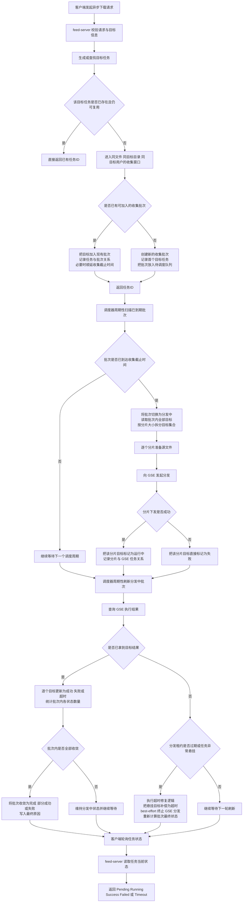

# Async Download V2 实施计划

> **给 agentic worker 的说明：** 必须使用 `superpowers:subagent-driven-development`（推荐）或 `superpowers:executing-plans`，按任务逐项实现本计划。步骤使用复选框语法（`- [ ]`）进行跟踪。

**目标：** 将 feed-server 中热点文件的异步下载任务创建路径替换为基于 V2 batch 的设计，去掉按文件维度的请求加锁，保持客户端 API 不变，支持多实例 scheduler，在首个 V2 版本中继续消费 V1 job，并保持多租户行为不变。

**架构：** 在 gRPC 边界保持 `AsyncDownload` 和 `AsyncDownloadStatus` 不变。内部新增 V2 batch/task 的 Redis 记录、按 `(fileVersionKey, targetID)` 维度的轻量 inflight 去重项、由 due queue 驱动并带有 dispatch lease/repair 的 scheduler，以及一条迁移路径：首个 V2 版本只创建 V2 task，但仍继续消费历史 V1 job。dispatch lease 超时后，V2 会把未完成 task 收口为 `Timeout`，并对仍在执行的 GSE 分发做 best-effort terminate。

**技术栈：** Go、feed-server 的 BLL/service 层、通过 `internal/dal/bedis` 访问 Redis、GSE 传输 API、Prometheus 指标、`pkg/cc` 中的 YAML 配置，以及基于 `stretchr/testify` 和 `alicebob/miniredis/v2` 的 Go 单元测试。

## 工作流程图

下面这张图描述当前 V2 的业务工作流程，不包含代码方法名，重点说明请求如何进入收集、何时开始分发、以及结果如何收敛。



补充说明：

- 请求线程只负责创建任务、加入批次并返回任务 ID，不会在请求线程里执行真实下载。
- 收集阶段的目标是把同一文件、同一目标目录、同一目标用户的一批请求合并成一个批次，降低热点并发下的入口放大效应。
- 真正的下载和分发由后台调度器推进，调度器会把一个批次拆成多个分片，再交给 GSE 批量处理。
- 结果收敛分为正常路径和 repair 路径两类，确保任务不会长期停留在 Running/Pending 而没有最终状态。

---

## 文件映射

### 需要修改的现有文件

- `pkg/cc/types.go`
  - 增加 `gse.asyncDownloadV2` 运行时配置结构、默认值和校验。
- `pkg/cc/service.go`
  - 确保新的嵌套配置会作为 `FeedServerSetting` 的一部分被设置默认值并校验。
- `docs/config/example/bk-bscp-feed.yaml`
  - 在 `gse` 下增加 V2 配置示例块。
- `cmd/feed-server/bll/types/types.go`
  - 增加 V2 batch/task 常量和 DTO。
- `cmd/feed-server/bll/asyncdownload/asyncdownload.go`
  - 服务端默认将 create/status 调用路由到 V2；迁移期间保留 V1 status fallback。
- `cmd/feed-server/bll/asyncdownload/scheduler.go`
  - 在首个 V2 版本中保留 legacy V1 drain loop，并启动 V2 loop。
- `cmd/feed-server/bll/asyncdownload/metrics.go`
  - 增加 V2 的 batch/due/shard/repair 指标。
- `cmd/feed-server/bll/bll.go`
  - 只构建一次支持 V2 的 scheduler/service，并保持当前启动拓扑不变。

### 需要新建的文件

- `cmd/feed-server/bll/asyncdownload/v2_keys.go`
  - V2 Redis key 构造器和少量 key 解析辅助函数。
- `cmd/feed-server/bll/asyncdownload/v2_store.go`
  - 面向 V2 batch/task/inflight 状态的专用 Redis 访问层。
- `cmd/feed-server/bll/asyncdownload/v2_service.go`
  - V2 task 创建和状态查询编排。
- `cmd/feed-server/bll/asyncdownload/v2_scheduler.go`
  - due queue 消费、dispatch lease、shard 执行以及聚合逻辑。
- `cmd/feed-server/bll/asyncdownload/v2_repair.go`
  - dispatch timeout repair、best-effort terminate GSE、陈旧 inflight key、终态 batch 清理的 repair/fan-out 辅助逻辑。
- `cmd/feed-server/bll/asyncdownload/v2_store_test.go`
  - 基于 Redis 的 V2 store 行为单元测试。
- `cmd/feed-server/bll/asyncdownload/v2_service_test.go`
  - 请求路径测试，覆盖 inflight 去重、join batch/new batch 创建以及 status fallback。
- `cmd/feed-server/bll/asyncdownload/v2_scheduler_test.go`
  - scheduler lease、repair 和 V1-drain 测试。

### 新增依赖

- `go.mod`
- `go.sum`
  - 增加 `github.com/alicebob/miniredis/v2`，用于可确定性地执行基于 Redis 的测试。

## AsyncDownloadV2 配置说明

下面的配置以当前代码实现为准，配置类型定义在 `pkg/cc/types.go`。

| 配置项 | 默认值 | 单位 | 说明 |
| --- | --- | --- | --- |
| `enabled` | `false` | 布尔值 | 仅为兼容旧配置保留。当前 feed-server 运行时默认启用 V2，不再依赖这个字段决定是否开启。 |
| `collectWindowSeconds` | `10` | 秒 | 批次收集窗口时长。新请求会优先加入仍处于收集期的批次，在窗口结束后才进入调度。 |
| `maxTargetsPerBatch` | `5000` | 个目标 | 单个批次允许容纳的最大目标数。达到上限后，需要创建新的批次。 |
| `shardSize` | `500` | 个目标 | 一个批次在实际下发时按多少目标拆成一个分片。每个分片会发起一次 GSE 下发。 |
| `dispatchHeartbeatSeconds` | `15` | 秒 | 分发中的批次用于续租/心跳的时间粒度配置。当前实现只有在任务状态出现实际推进时才会刷新心跳和租约。 |
| `dispatchLeaseSeconds` | `60` | 秒 | 分发租约时长。超过这个时间仍未正常推进的批次，会被视为 dispatch timeout，并触发 repair 与 best-effort terminate。 |
| `maxDispatchAttempts` | `3` | 次 | 同一个批次允许进入分发流程的最大次数，用于限制异常情况下的重复调度。 |
| `maxDueBatchesPerTick` | `100` | 个批次 | 每轮调度从 due queue 里最多取出的到期批次数量，用于限制单轮调度工作量。 |
| `taskTTLSeconds` | `86400` | 秒 | 单个 V2 task 在 Redis 中的保留时长，默认 1 天。 |
| `batchTTLSeconds` | `86400` | 秒 | 单个 V2 batch 在 Redis 中的保留时长，默认 1 天。 |

## V2 指标说明

V2 的指标不再复用旧版“job/task”语义，而是围绕 V2 自己真正关心的四段流程来定义：收集、分发、收敛、修复。

### 1. 收集与排队

| 指标名 | 类型 | 标签 | 说明 |
| --- | --- | --- | --- |
| `bscp_async_download_batch_due_backlog` | Gauge | 无 | 当前已经到期、正在等待调度器处理的 V2 batch 数量。用于看 due queue 是否堆积。 |
| `bscp_async_download_batch_oldest_due_age_seconds` | Gauge | 无 | 最老那个 due batch 已经超出收集截止时间多久。这个值持续增大时，通常说明调度器处理跟不上。 |
| `bscp_async_download_v2_batch_state_count` | Counter | `biz`, `app`, `state` | V2 batch 进入某个状态的次数。当前会覆盖 `Collecting`、`Dispatching`、`Done`、`Partial`、`Failed`。不带文件维度，避免高基数时序膨胀。 |
| `bscp_async_download_v2_batch_state_duration_seconds` | Histogram | `biz`, `app`, `state` | V2 batch 在某个状态停留的耗时分布。当前重点是 `Collecting` 和 `Dispatching` 两段。不带文件维度，适合 Prometheus 聚合。 |

### 2. 任务推进与结果收敛

| 指标名 | 类型 | 标签 | 说明 |
| --- | --- | --- | --- |
| `bscp_async_download_v2_task_state_count` | Counter | `biz`, `app`, `state` | V2 task 进入某个状态的次数。当前会覆盖 `Pending`、`Running`、`Success`、`Failed`、`Timeout`。不带文件维度，避免单文件造成过多时序。 |
| `bscp_async_download_v2_task_state_duration_seconds` | Histogram | `biz`, `app`, `state` | V2 task 在某个状态停留的耗时分布。用于看任务从排队到运行、从运行到最终结果分别花了多久。 |

### 3. 分片下发

| 指标名 | 类型 | 标签 | 说明 |
| --- | --- | --- | --- |
| `bscp_async_download_shard_dispatch_count` | Counter | `status` | 分片下发次数，当前主要按 `success` / `failed` 统计。用于看 GSE 下发是否健康。 |
| `bscp_async_download_shard_duration_seconds` | Histogram | `status` | 单个分片从准备源文件到发起 GSE 下发结束的耗时分布。用于看热点文件和 GSE 调用是否变慢。 |

### 4. 异常修复

| 指标名 | 类型 | 标签 | 说明 |
| --- | --- | --- | --- |
| `bscp_async_download_task_repair_count` | Counter | `reason` | repair 将异常悬挂任务补偿为终态的次数。当前原因包括 `batch_failed`、`dispatch_timeout`、`orphan_after_dispatch_cutoff`。 |

### 指标使用建议

- 看系统有没有堆积：优先看 `batch_due_backlog` 和 `batch_oldest_due_age_seconds`
- 看请求进入后批次有没有迟迟不发：看 `v2_batch_state_count{state="Collecting"}` 和 `v2_batch_state_duration_seconds`
- 看 GSE 下发是否异常：看 `shard_dispatch_count` 和 `shard_duration_seconds`
- 看任务最终是否顺利收敛：看 `v2_task_state_count{state="Success|Failed|Timeout"}`
- 看是不是经常靠兜底修复：看 `task_repair_count`

## 任务 1：增加配置和 V2 数据类型

**文件：**
- 修改：`pkg/cc/types.go`
- 修改：`pkg/cc/service.go`
- 修改：`cmd/feed-server/bll/types/types.go`
- 修改：`docs/config/example/bk-bscp-feed.yaml`
- 测试：`cmd/feed-server/bll/asyncdownload/v2_service_test.go`

- [ ] **步骤 1：先写失败的配置/类型测试**

```go
func TestAsyncDownloadV2ConfigDefaults(t *testing.T) {
	g := cc.GSE{}
	g.TrySetDefaultForTest()

	require.False(t, g.AsyncDownloadV2.Enabled)
	require.Equal(t, 10, g.AsyncDownloadV2.CollectWindowSeconds)
	require.Equal(t, 5000, g.AsyncDownloadV2.MaxTargetsPerBatch)
	require.Equal(t, 500, g.AsyncDownloadV2.ShardSize)
	require.Equal(t, 15, g.AsyncDownloadV2.DispatchHeartbeatSeconds)
	require.Equal(t, 60, g.AsyncDownloadV2.DispatchLeaseSeconds)
	require.Equal(t, 3, g.AsyncDownloadV2.MaxDispatchAttempts)
	require.Equal(t, 100, g.AsyncDownloadV2.MaxDueBatchesPerTick)
	require.Equal(t, 86400, g.AsyncDownloadV2.TaskTTLSeconds)
	require.Equal(t, 86400, g.AsyncDownloadV2.BatchTTLSeconds)
}
```

- [ ] **步骤 2：运行测试，确认它会失败**

运行：`go test ./cmd/feed-server/bll/asyncdownload -run TestAsyncDownloadV2ConfigDefaults -v`

预期：由于 `AsyncDownloadV2` 字段未知或缺少 helper，测试 FAIL。

- [ ] **步骤 3：增加配置结构、默认值、校验以及 V2 类型定义**

```go
type AsyncDownloadV2 struct {
	// Enabled 字段仅为兼容配置保留；在 feed-server 运行时不再作为 V2 开关使用。
	Enabled                  bool `yaml:"enabled"`
	CollectWindowSeconds     int  `yaml:"collectWindowSeconds"`
	MaxTargetsPerBatch       int  `yaml:"maxTargetsPerBatch"`
	ShardSize                int  `yaml:"shardSize"`
	DispatchHeartbeatSeconds int  `yaml:"dispatchHeartbeatSeconds"`
	DispatchLeaseSeconds     int  `yaml:"dispatchLeaseSeconds"`
	MaxDispatchAttempts      int  `yaml:"maxDispatchAttempts"`
	MaxDueBatchesPerTick     int  `yaml:"maxDueBatchesPerTick"`
	TaskTTLSeconds           int  `yaml:"taskTTLSeconds"`
	BatchTTLSeconds          int  `yaml:"batchTTLSeconds"`
}

type GSE struct {
	Enabled         bool            `yaml:"enabled"`
	AsyncDownloadV2 AsyncDownloadV2 `yaml:"asyncDownloadV2"`
	// existing fields...
}

func (v *AsyncDownloadV2) trySetDefault() {
	if v.CollectWindowSeconds == 0 { v.CollectWindowSeconds = 10 }
	if v.MaxTargetsPerBatch == 0 { v.MaxTargetsPerBatch = 5000 }
	if v.ShardSize == 0 { v.ShardSize = 500 }
	if v.DispatchHeartbeatSeconds == 0 { v.DispatchHeartbeatSeconds = 15 }
	if v.DispatchLeaseSeconds == 0 { v.DispatchLeaseSeconds = 60 }
	if v.MaxDispatchAttempts == 0 { v.MaxDispatchAttempts = 3 }
	if v.MaxDueBatchesPerTick == 0 { v.MaxDueBatchesPerTick = 100 }
	if v.TaskTTLSeconds == 0 { v.TaskTTLSeconds = 86400 }
	if v.BatchTTLSeconds == 0 { v.BatchTTLSeconds = 86400 }
}
```

同时在 `cmd/feed-server/bll/types/types.go` 中增加 V2 DTO/常量：

```go
const (
	AsyncDownloadBatchStateCollecting  = "Collecting"
	AsyncDownloadBatchStateDispatching = "Dispatching"
	AsyncDownloadBatchStateDone        = "Done"
	AsyncDownloadBatchStatePartial     = "Partial"
	AsyncDownloadBatchStateFailed      = "Failed"
)

type AsyncDownloadV2Batch struct {
	BatchID             string    `json:"batch_id"`
	TenantID            string    `json:"tenant_id"`
	BizID               uint32    `json:"biz_id"`
	AppID               uint32    `json:"app_id"`
	FilePath            string    `json:"file_path"`
	FileName            string    `json:"file_name"`
	FileSignature       string    `json:"file_signature"`
	State               string    `json:"state"`
	OpenUntil           time.Time `json:"open_until"`
	CreatedAt           time.Time `json:"created_at"`
	DispatchStartedAt   time.Time `json:"dispatch_started_at"`
	DispatchOwner       string    `json:"dispatch_owner"`
	DispatchLeaseUntil  time.Time `json:"dispatch_lease_until"`
	DispatchHeartbeatAt time.Time `json:"dispatch_heartbeat_at"`
	DispatchAttempt     int       `json:"dispatch_attempt"`
	TargetCount         int       `json:"target_count"`
	SuccessCount        int       `json:"success_count"`
	FailedCount         int       `json:"failed_count"`
	TimeoutCount        int       `json:"timeout_count"`
	ShardCount          int       `json:"shard_count"`
	FinalReason         string    `json:"final_reason"`
}

type AsyncDownloadV2Task struct {
	TaskID        string    `json:"task_id"`
	BatchID       string    `json:"batch_id"`
	TargetID      string    `json:"target_id"`
	BizID         uint32    `json:"biz_id"`
	AppID         uint32    `json:"app_id"`
	TenantID      string    `json:"tenant_id"`
	FilePath      string    `json:"file_path"`
	FileName      string    `json:"file_name"`
	FileSignature string    `json:"file_signature"`
	State         string    `json:"state"`
	CreatedAt     time.Time `json:"created_at"`
	UpdatedAt     time.Time `json:"updated_at"`
	ErrMsg        string    `json:"err_msg"`
}
```

- [ ] **步骤 4：运行测试，确认默认值和类型能通过编译**

运行：`go test ./cmd/feed-server/bll/asyncdownload -run TestAsyncDownloadV2ConfigDefaults -v`

预期：PASS

- [ ] **步骤 5：提交**

```bash
git add pkg/cc/types.go pkg/cc/service.go cmd/feed-server/bll/types/types.go docs/config/example/bk-bscp-feed.yaml
git commit -m "feat: add async download v2 config and types"
```

## 任务 2：构建 V2 Redis Key 与 Store 层

**文件：**
- 新建：`cmd/feed-server/bll/asyncdownload/v2_keys.go`
- 新建：`cmd/feed-server/bll/asyncdownload/v2_store.go`
- 新建：`cmd/feed-server/bll/asyncdownload/v2_store_test.go`
- 修改：`go.mod`
- 修改：`go.sum`

- [ ] **步骤 1：先写基于 miniredis 的失败测试**

```go
func TestV2StoreCreateBatchAndInflight(t *testing.T) {
	mr := miniredis.RunT(t)
	opt := cc.RedisCluster{Mode: cc.RedisStandaloneMode, Endpoints: []string{mr.Addr()}}
	bds, err := bedis.NewRedisCache(opt)
	require.NoError(t, err)

	store := newV2Store(bds, cc.AsyncDownloadV2{
		TaskTTLSeconds:  86400,
		BatchTTLSeconds: 86400,
	})

	ctx := context.Background()
	key := buildFileVersionKey(706, 192, "/path", "protocol.tar.gz", "sha256")
	targetID := "agent:container"
	taskID := "task-1"
	batchID := "batch-1"

	err = store.createBatchAndTask(ctx, key, batchID, targetID, taskID, &types.AsyncDownloadV2Batch{
		BatchID: batchID,
		State:   types.AsyncDownloadBatchStateCollecting,
	}, &types.AsyncDownloadV2Task{TaskID: taskID, BatchID: batchID, TargetID: targetID})
	require.NoError(t, err)

	gotTaskID, err := store.getInflightTaskID(ctx, key, targetID)
	require.NoError(t, err)
	require.Equal(t, taskID, gotTaskID)

	targets, err := store.listBatchTargets(ctx, batchID)
	require.NoError(t, err)
	require.Equal(t, []string{targetID}, targets)
}
```

- [ ] **步骤 2：运行测试，确认它会失败**

运行：`go test ./cmd/feed-server/bll/asyncdownload -run TestV2StoreCreateBatchAndInflight -v`

预期：由于 `newV2Store`、key builder 以及 miniredis 依赖尚不存在，测试 FAIL。

- [ ] **步骤 3：增加 miniredis，并实现 key/store 辅助逻辑**

```go
func batchOpenKey(fileVersionKey string) string {
	return fmt.Sprintf("AsyncBatchOpenV2:%s", fileVersionKey)
}

func batchMetaKey(batchID string) string {
	return fmt.Sprintf("AsyncBatchMetaV2:%s", batchID)
}

func batchTargetsKey(batchID string) string {
	return fmt.Sprintf("AsyncBatchTargetsV2:%s", batchID)
}

func batchTasksKey(batchID string) string {
	return fmt.Sprintf("AsyncBatchTasksV2:%s", batchID)
}

func batchDispatchedTargetsKey(batchID string) string {
	return fmt.Sprintf("AsyncBatchDispatchedTargetsV2:%s", batchID)
}

func inflightKey(fileVersionKey, targetID string) string {
	return fmt.Sprintf("AsyncTargetInflightV2:%s:%s", fileVersionKey, targetID)
}
```

需要实现的 Store API：

```go
type v2Store struct {
	bds bedis.Client
	cfg cc.AsyncDownloadV2
}

func (s *v2Store) createBatchAndTask(ctx context.Context, fileVersionKey, batchID, targetID, taskID string,
	batch *types.AsyncDownloadV2Batch, task *types.AsyncDownloadV2Task) error

func (s *v2Store) addTaskToBatch(ctx context.Context, batchID, fileVersionKey, targetID, taskID string,
	task *types.AsyncDownloadV2Task) error

func (s *v2Store) getInflightTaskID(ctx context.Context, fileVersionKey, targetID string) (string, error)
func (s *v2Store) getOpenBatchID(ctx context.Context, fileVersionKey string) (string, error)
func (s *v2Store) getBatch(ctx context.Context, batchID string) (*types.AsyncDownloadV2Batch, error)
func (s *v2Store) getTask(ctx context.Context, taskID string) (*types.AsyncDownloadV2Task, error)
func (s *v2Store) listBatchTargets(ctx context.Context, batchID string) ([]string, error)
func (s *v2Store) listBatchTasks(ctx context.Context, batchID string) ([]string, error)
```

只使用 `bedis.Client` 提供的命令；不要使用 Lua，也不要假设跨 key 原子性。

- [ ] **步骤 4：运行 store 测试**

运行：`go test ./cmd/feed-server/bll/asyncdownload -run 'TestV2Store' -v`

预期：PASS

- [ ] **步骤 5：提交**

```bash
git add go.mod go.sum cmd/feed-server/bll/asyncdownload/v2_keys.go cmd/feed-server/bll/asyncdownload/v2_store.go cmd/feed-server/bll/asyncdownload/v2_store_test.go
git commit -m "feat: add async download v2 redis store"
```

## 任务 3：将 AsyncDownload 的 Create/Status 路由到 V2

**文件：**
- 修改：`cmd/feed-server/bll/asyncdownload/asyncdownload.go`
- 新建：`cmd/feed-server/bll/asyncdownload/v2_service.go`
- 新建：`cmd/feed-server/bll/asyncdownload/v2_service_test.go`
- 修改：`cmd/feed-server/bll/bll.go`

- [ ] **步骤 1：先写失败的 service 测试**

```go
func TestCreateAsyncDownloadTaskV2ReusesInflightTask(t *testing.T) {
	svc, kt := newTestAsyncDownloadService(t)

	firstID, err := svc.CreateAsyncDownloadTask(kt, 706, 192, "/cfg", "protocol.tar.gz",
		"agent-a", "container-a", "root", "/tmp", "sig-1")
	require.NoError(t, err)

	secondID, err := svc.CreateAsyncDownloadTask(kt, 706, 192, "/cfg", "protocol.tar.gz",
		"agent-a", "container-a", "root", "/tmp", "sig-1")
	require.NoError(t, err)

	require.Equal(t, firstID, secondID)
}

func TestGetAsyncDownloadTaskStatusFallsBackToV1DuringMigration(t *testing.T) {
	svc, kt := newTestAsyncDownloadService(t)
	taskID := seedLegacyV1Task(t, svc, kt)

	status, err := svc.GetAsyncDownloadTaskStatus(kt, 706, taskID)
	require.NoError(t, err)
	require.Equal(t, types.AsyncDownloadJobStatusPending, status)
}
```

- [ ] **步骤 2：运行测试，确认它会失败**

运行：`go test ./cmd/feed-server/bll/asyncdownload -run 'Test(CreateAsyncDownloadTaskV2ReusesInflightTask|GetAsyncDownloadTaskStatusFallsBackToV1DuringMigration)' -v`

预期：由于 service 仍然只使用 V1 逻辑，测试 FAIL。

- [ ] **步骤 3：实现 V2 请求编排**

```go
func (ad *Service) CreateAsyncDownloadTask(kt *kit.Kit, bizID, appID uint32, filePath, fileName,
	targetAgentID, targetContainerID, targetUser, targetDir, signature string) (string, error) {
	return ad.v2.createTask(kt, bizID, appID, filePath, fileName,
		targetAgentID, targetContainerID, targetUser, targetDir, signature)
}

func (s *v2Service) createTask(kt *kit.Kit, bizID, appID uint32, filePath, fileName,
	targetAgentID, targetContainerID, targetUser, targetDir, signature string) (string, error) {
	fileVersionKey := buildFileVersionKey(bizID, appID, filePath, fileName, signature)
	targetID := buildTargetID(targetAgentID, targetContainerID)

	if taskID, err := s.tryReuseInflightTask(kt.Ctx, fileVersionKey, targetID); err == nil && taskID != "" {
		return taskID, nil
	}

	return s.createOrJoinBatch(kt, fileVersionKey, targetID, targetUser, targetDir, signature)
}
```

Status 查询规则：

```go
func (ad *Service) GetAsyncDownloadTaskStatus(kt *kit.Kit, bizID uint32, taskID string) (string, error) {
	if status, err := ad.v2.getTaskStatus(kt.Ctx, taskID); err == nil {
		return status, nil
	}
	return ad.getAsyncDownloadTaskStatusV1(kt, bizID, taskID)
}
```

- [ ] **步骤 4：运行 service 测试**

运行：`go test ./cmd/feed-server/bll/asyncdownload -run 'Test(CreateAsyncDownloadTaskV2ReusesInflightTask|GetAsyncDownloadTaskStatusFallsBackToV1DuringMigration)' -v`

预期：PASS

- [ ] **步骤 5：提交**

```bash
git add cmd/feed-server/bll/asyncdownload/asyncdownload.go cmd/feed-server/bll/asyncdownload/v2_service.go cmd/feed-server/bll/asyncdownload/v2_service_test.go cmd/feed-server/bll/bll.go
git commit -m "feat: route async download create and status through v2"
```

## 任务 4：实现 V2 Scheduler 核心逻辑

**文件：**
- 新建：`cmd/feed-server/bll/asyncdownload/v2_scheduler.go`
- 修改：`cmd/feed-server/bll/asyncdownload/scheduler.go`
- 新建：`cmd/feed-server/bll/asyncdownload/v2_scheduler_test.go`

- [ ] **步骤 1：先写失败的 scheduler 测试**

```go
func TestV2SchedulerClaimsDueBatchAndSetsLease(t *testing.T) {
	sch, store := newTestV2Scheduler(t)
	batchID := seedCollectingBatch(t, store)

	err := sch.processDueBatches(context.Background())
	require.NoError(t, err)

	batch := mustGetBatch(t, store, batchID)
	require.Equal(t, types.AsyncDownloadBatchStateDispatching, batch.State)
	require.NotZero(t, batch.DispatchLeaseUntil)
	require.Equal(t, 1, batch.DispatchAttempt)
}

func TestV2SchedulerLimitsDueBatchFetch(t *testing.T) {
	sch, store := newTestV2Scheduler(t)
	seedManyDueBatches(t, store, 150)

	processed, err := sch.processDueBatches(context.Background())
	require.NoError(t, err)
	require.Equal(t, 100, processed)
}
```

- [ ] **步骤 2：运行测试，确认它会失败**

运行：`go test ./cmd/feed-server/bll/asyncdownload -run 'TestV2Scheduler(ClaimsDueBatchAndSetsLease|LimitsDueBatchFetch)' -v`

预期：由于还没有 V2 scheduler loop，测试 FAIL。

- [ ] **步骤 3：实现 due queue、dispatch lease 和 shard 拆分**

```go
type v2Scheduler struct {
	store    *v2Store
	gse      *gse.Service
	provider repository.Provider
	redLock  *lock.RedisLock
	metric   *metric
	instance string
	cfg      cc.AsyncDownloadV2
}

func (s *v2Scheduler) processDueBatches(ctx context.Context) (int, error) {
	batchIDs, err := s.store.listDueBatchIDs(ctx, time.Now(), s.cfg.MaxDueBatchesPerTick)
	if err != nil {
		return 0, err
	}
	for _, batchID := range batchIDs {
		if err := s.processBatch(ctx, batchID); err != nil {
			logs.Errorf("process v2 batch %s failed, err: %v", batchID, err)
		}
	}
	return len(batchIDs), nil
}

func splitTargets(targets []string, shardSize int) [][]string {
	var shards [][]string
	for len(targets) > 0 {
		n := min(shardSize, len(targets))
		shards = append(shards, append([]string(nil), targets[:n]...))
		targets = targets[n:]
	}
	return shards
}
```

同时更新 `scheduler.go`，让 `Run()` 启动：

```go
go a.runV1DrainLoop()
go a.runV2Loop()
```

并且 V1 drain 只处理 legacy `AsyncDownloadJob:*` key。

- [ ] **步骤 4：运行 scheduler 测试**

运行：`go test ./cmd/feed-server/bll/asyncdownload -run 'TestV2Scheduler' -v`

预期：PASS

- [ ] **步骤 5：提交**

```bash
git add cmd/feed-server/bll/asyncdownload/scheduler.go cmd/feed-server/bll/asyncdownload/v2_scheduler.go cmd/feed-server/bll/asyncdownload/v2_scheduler_test.go
git commit -m "feat: add async download v2 scheduler core"
```

## 任务 5：实现 Repair、终态 Fan-Out 和 V1 Drain 兼容

**文件：**
- 新建：`cmd/feed-server/bll/asyncdownload/v2_repair.go`
- 修改：`cmd/feed-server/bll/asyncdownload/v2_scheduler.go`
- 修改：`cmd/feed-server/bll/asyncdownload/scheduler.go`
- 新建：`cmd/feed-server/bll/asyncdownload/v2_scheduler_test.go`

- [ ] **步骤 1：先写失败的 repair 测试**

```go
func TestV2RepairMarksTimeoutTaskAfterDispatchCutoff(t *testing.T) {
	sch, store := newTestV2Scheduler(t)
	batchID, taskID := seedBatchWithPendingTaskNotDispatched(t, store)

	err := sch.repairTimeoutBatch(context.Background(), batchID)
	require.NoError(t, err)

	task := mustGetTask(t, store, taskID)
	require.Equal(t, types.AsyncDownloadJobStatusTimeout, task.State)
	require.Equal(t, "dispatch_timeout", task.ErrMsg)
}

func TestV2RepairFailsTasksWhenBatchFails(t *testing.T) {
	sch, store := newTestV2Scheduler(t)
	batchID, taskIDs := seedFailedBatchWithPendingTasks(t, store)

	err := sch.finalizeBatchTasks(context.Background(), batchID, types.AsyncDownloadBatchStateFailed)
	require.NoError(t, err)

	for _, taskID := range taskIDs {
		task := mustGetTask(t, store, taskID)
		require.Equal(t, types.AsyncDownloadJobStatusFailed, task.State)
	}
}

func TestV2TimeoutRepairTerminatesRunningGSETransfer(t *testing.T) {
	svc, sch, kt := newIntegratedTestHarness(t)
	gseClient := mustGetFakeTransferClient(t, sch)
	gseClient.resultBuilder = func(_ string, req *gse.TransferFileReq) []gse.TransferFileResultDataResult {
		return []gse.TransferFileResultDataResult{{
			ErrorCode: 115,
			Content: gse.TransferFileResultDataResultContent{
				DestAgentID:     req.Tasks[0].Target.Agents[0].BkAgentID,
				DestContainerID: req.Tasks[0].Target.Agents[0].BkContainerID,
				DestFileDir:     req.Tasks[0].Target.StoreDir,
				DestFileName:    req.Tasks[0].Target.FileName,
			},
		}}
	}

	taskID, err := svc.CreateTask(kt, 706, 192, "/cfg", "protocol.tar.gz",
		"agent-a", "container-a", "tester", "/data/releases", "sig-1")
	require.NoError(t, err)
	forceTaskBatchDue(t, svc, sch, kt, taskID)

	_, err = sch.ProcessDueBatches(context.Background())
	require.NoError(t, err)

	task, err := svc.Store().GetTask(kt.Ctx, taskID)
	require.NoError(t, err)
	batch, err := sch.Store().GetBatch(kt.Ctx, task.BatchID)
	require.NoError(t, err)
	batch.DispatchLeaseUntil = time.Now().Add(-time.Second)
	require.NoError(t, sch.Store().SaveBatch(kt.Ctx, batch))

	_, err = sch.ProcessDueBatches(context.Background())
	require.NoError(t, err)

	require.Len(t, gseClient.terminateReqs, 1)
	require.Equal(t, "gse-task-1", gseClient.terminateReqs[0].TaskID)
	require.Len(t, gseClient.terminateReqs[0].Agents, 1)
}

func TestLegacyV1JobStillDrainsInFirstV2Release(t *testing.T) {
	sch, store := newLegacyCompatibleScheduler(t)
	legacyJobID := seedLegacyPendingJob(t, store)

	err := sch.runOneV1DrainPass(context.Background())
	require.NoError(t, err)

	job := mustGetLegacyJob(t, store, legacyJobID)
	require.NotEqual(t, types.AsyncDownloadJobStatusPending, job.Status)
}
```

- [ ] **步骤 2：运行测试，确认它会失败**

运行：`go test ./cmd/feed-server/bll/asyncdownload -run 'Test(V2Repair|LegacyV1JobStillDrainsInFirstV2Release)' -v`

预期：由于 repair helper 和显式 V1 drain pass 还不存在，测试 FAIL。

- [ ] **步骤 3：实现 repair 和终态 fan-out 规则**

```go
func (s *v2Scheduler) finalizeTimeoutBatchTasks(ctx context.Context, batchID string) error {
	taskIDs, err := s.store.listBatchTasks(ctx, batchID)
	if err != nil {
		return err
	}

	for _, taskID := range taskIDs {
		task, err := s.store.getTask(ctx, taskID)
		if err != nil || isFinalTaskState(task.State) {
			continue
		}
		task.State = types.AsyncDownloadJobStatusTimeout
		task.ErrMsg = "dispatch_timeout"
		task.UpdatedAt = time.Now()
		if err := s.store.saveTask(ctx, task); err != nil {
			return err
		}
	}
	return nil
}
```

在 `v2_repair.go` 中补充 timeout repair 的 terminate 逻辑：

```go
func (s *v2Scheduler) terminateBatchDispatches(batch *types.AsyncDownloadV2Batch) {
	dispatchState, _ := s.store.listBatchDispatchState(ctx, batch.BatchID)
	targetTasks, _ := s.store.listBatchTargetTasks(ctx, batch.BatchID)
	groupedAgents := make(map[string][]gse.TransferFileAgent)

	for targetID, gseTaskID := range dispatchState {
		if gseTaskID == "" || gseTaskID == "local" {
			continue
		}
		taskID := targetTasks[targetID]
		task, err := s.store.getTask(ctx, taskID)
		if err != nil || isFinalTaskState(task.State) {
			continue
		}
		agentID, containerID := parseTargetID(targetID)
		groupedAgents[gseTaskID] = append(groupedAgents[gseTaskID], gse.TransferFileAgent{
			User:          task.TargetUser,
			BkAgentID:     agentID,
			BkContainerID: containerID,
		})
	}

	for gseTaskID, agents := range groupedAgents {
		if len(agents) == 0 {
			continue
		}
		_, _ = s.gseService.AsyncTerminateTransferFile(ctx, &gse.TerminateTransferFileTaskReq{
			TaskID: gseTaskID,
			Agents: agents,
		})
	}
}
```

在 `scheduler.go` 中增加显式 V1 drain 方法：

```go
func (a *Scheduler) runOneV1DrainPass(ctx context.Context) error {
	keys, err := a.bds.Keys(ctx, "AsyncDownloadJob:*")
	if err != nil {
		return err
	}
	for _, key := range keys {
		if err := a.handleOneLegacyJob(ctx, key); err != nil {
			logs.Errorf("handle legacy async job %s failed, err: %v", key, err)
		}
	}
	return nil
}
```

- [ ] **步骤 4：运行 repair 和迁移测试**

运行：`go test ./cmd/feed-server/bll/asyncdownload -run 'Test(V2Repair|LegacyV1JobStillDrainsInFirstV2Release)' -v`

预期：PASS

- [ ] **步骤 5：提交**

```bash
git add cmd/feed-server/bll/asyncdownload/v2_repair.go cmd/feed-server/bll/asyncdownload/v2_scheduler.go cmd/feed-server/bll/asyncdownload/scheduler.go cmd/feed-server/bll/asyncdownload/v2_scheduler_test.go
git commit -m "feat: add v2 repair flow and v1 drain compatibility"
```

## 任务 6：指标、日志与完整包验证

**文件：**
- 修改：`cmd/feed-server/bll/asyncdownload/metrics.go`
- 修改：`cmd/feed-server/bll/asyncdownload/v2_service.go`
- 修改：`cmd/feed-server/bll/asyncdownload/v2_scheduler.go`
- 修改：`cmd/feed-server/bll/asyncdownload/v2_repair.go`
- 测试：`cmd/feed-server/bll/asyncdownload/v2_scheduler_test.go`

- [ ] **步骤 1：先写失败的指标/日志测试**

```go
func TestV2MetricsRegisterBacklogAndRepairCounters(t *testing.T) {
	m := InitMetric()

	require.NotNil(t, m.batchDueBacklog)
	require.NotNil(t, m.batchOldestDueAgeSeconds)
	require.NotNil(t, m.taskRepairCounter)
}
```

- [ ] **步骤 2：运行测试，确认它会失败**

运行：`go test ./cmd/feed-server/bll/asyncdownload -run TestV2MetricsRegisterBacklogAndRepairCounters -v`

预期：由于 V2 指标字段尚未定义，测试 FAIL。

- [ ] **步骤 3：增加 V2 指标并补齐日志字段**

```go
type metric struct {
	jobDurationSeconds       *prometheus.HistogramVec
	jobCounter               *prometheus.CounterVec
	taskDurationSeconds      *prometheus.HistogramVec
	taskCounter              *prometheus.CounterVec
	sourceFilesSizeBytes     prometheus.Gauge
	sourceFilesCounter       prometheus.Gauge
	batchDueBacklog          prometheus.Gauge
	batchOldestDueAgeSeconds prometheus.Gauge
	taskRepairCounter        *prometheus.CounterVec
	shardDispatchCounter     *prometheus.CounterVec
	shardDurationSeconds     *prometheus.HistogramVec
}
```

每个 V2 日志点至少应包含：

```go
logs.Infof("v2 batch dispatch, biz_id=%d app_id=%d batch_id=%s file=%s/%s shard_count=%d",
	batch.BizID, batch.AppID, batch.BatchID, batch.FilePath, batch.FileName, batch.ShardCount)
```

- [ ] **步骤 4：运行完整的 asyncdownload 包测试**

运行：`go test ./cmd/feed-server/bll/asyncdownload -v`

预期：PASS

- [ ] **步骤 5：提交**

```bash
git add cmd/feed-server/bll/asyncdownload/metrics.go cmd/feed-server/bll/asyncdownload/v2_service.go cmd/feed-server/bll/asyncdownload/v2_scheduler.go cmd/feed-server/bll/asyncdownload/v2_repair.go
git commit -m "feat: add async download v2 metrics and verification"
```

## 任务 7：端到端 Feed-Server 验证与发布说明

**文件：**
- 修改：`docs/superpowers/specs/2026-04-16-async-download-v2-design.md`（仅当实现改变了原有假设）
- 修改：`docs/config/example/bk-bscp-feed.yaml`（最终示例值）
- 测试：`cmd/feed-server/bll/asyncdownload/v2_service_test.go`
- 测试：`cmd/feed-server/bll/asyncdownload/v2_scheduler_test.go`

- [ ] **步骤 1：增加一个面向迁移场景的端到端测试**

```go
func TestAsyncDownloadV2CreateStatusAndDrainCompatibility(t *testing.T) {
	svc, sch := newIntegratedV2TestHarness(t)

	taskID, err := svc.CreateAsyncDownloadTask(testKit(), 706, 192, "/cfg", "protocol.tar.gz",
		"agent-a", "container-a", "root", "/tmp", "sig-1")
	require.NoError(t, err)

	require.NoError(t, sch.processDueBatches(context.Background()))

	status, err := svc.GetAsyncDownloadTaskStatus(testKit(), 706, taskID)
	require.NoError(t, err)
	require.Contains(t, []string{
		types.AsyncDownloadJobStatusRunning,
		types.AsyncDownloadJobStatusSuccess,
	}, status)
}
```

- [ ] **步骤 2：运行迁移测试与完整包测试**

运行：`go test ./cmd/feed-server/bll/asyncdownload -run TestAsyncDownloadV2CreateStatusAndDrainCompatibility -v`

运行：`go test ./cmd/feed-server/bll/asyncdownload -v`

预期：PASS

- [ ] **步骤 3：校验配置示例与 spec 假设**

```yaml
gse:
  enabled: true
  asyncDownloadV2:
    enabled: true
    collectWindowSeconds: 10
    maxTargetsPerBatch: 5000
    shardSize: 500
    dispatchHeartbeatSeconds: 15
    dispatchLeaseSeconds: 60
    maxDispatchAttempts: 3
    maxDueBatchesPerTick: 100
    taskTTLSeconds: 86400
    batchTTLSeconds: 86400
```

说明：`asyncDownloadV2.enabled` 字段仍可保留在配置中用于兼容旧配置，但按当前代码实现，feed-server 运行时不会再用它来决定是否启用 V2。

如果实现中修改了字段名或默认值，需要在同一个提交中同步更新 spec。

- [ ] **步骤 4：最终验证**

运行：`go test ./cmd/feed-server/bll/asyncdownload -v && go test ./cmd/feed-server/service -run TestNonExistent -count=0`

预期：asyncdownload 包 PASS；service 包命令快速退出且不执行测试。

- [ ] **步骤 5：提交**

```bash
git add docs/config/example/bk-bscp-feed.yaml docs/superpowers/specs/2026-04-16-async-download-v2-design.md cmd/feed-server/bll/asyncdownload/v2_service_test.go cmd/feed-server/bll/asyncdownload/v2_scheduler_test.go
git commit -m "test: verify async download v2 end to end"
```

## 自检

### Spec 覆盖情况

- V2 配置与默认值：任务 1
- V2 Redis 模型与 key：任务 2
- 请求路径与 inflight 去重：任务 3
- 多实例 scheduler 与 due queue：任务 4
- 首个 V2 版本中的 repair、终态 fan-out 和 V1 drain：任务 5
- 指标、日志、backlog 与验证：任务 6
- 最终迁移向验证以及配置/文档一致性检查：任务 7

没有任何 spec 章节被刻意遗漏。

### 占位符扫描

- 没有 `TODO` / `TBD`
- 没有“写测试”但不给具体测试代码的描述
- 没有“类似前一任务”这类模糊引用
- 所有命令都已明确给出

### 类型一致性

- 配置类型名：`cc.AsyncDownloadV2`
- V2 batch 类型：`types.AsyncDownloadV2Batch`
- V2 task 类型：`types.AsyncDownloadV2Task`
- Store helper 统一使用 `fileVersionKey`、`targetID`、`batchID`、`taskID`
- Scheduler lease 字段统一使用 `DispatchLeaseUntil`、`DispatchHeartbeatAt` 和 `DispatchAttempt`
- dispatch lease 超时的 repair 语义统一为 task `Timeout`、batch `FinalReason=dispatch_timeout`，并对仍在执行的 GSE 分发做 best-effort terminate
